# ServiQ — Entity Relationship Diagram

> **Mermaid erDiagram syntax** — renders in GitHub, GitLab, Notion, and most Markdown viewers.
> Cardinality notation: `||--o{` (one-to-many), `||--||` (one-to-one), `}o--o{` (many-to-many).

---

## 1. Identity & Auth


```mermaid
erDiagram
    profiles ||--o{ provider_categories : "has"
    profiles ||--o{ provider_services : "has"
    profiles ||--o{ provider_availability : "has"
    profiles ||--o{ provider_service_areas : "has"
    profiles ||--o{ provider_pricing_rules : "has"
    profiles ||--o{ provider_boosts : "has"
    profiles ||--o{ provider_analytics : "has"
    profiles ||--o{ provider_connections : "requester"
    profiles ||--o{ provider_connections : "receiver"
    profiles ||--o{ provider_verification : "has"
    profiles ||--o{ provider_subscriptions : "has"
    profiles ||--o{ provider_listings : "owns"
    profiles ||--o{ orders : "customer"
    profiles ||--o{ orders : "provider"
    profiles ||--o{ chat_conversations : "participant"
    profiles ||--o{ chat_messages : "sender"
    profiles ||--o{ notifications : "recipient"
    profiles ||--o{ feed_items : "author"
    profiles ||--o{ feed_interactions : "actor"
    profiles ||--o{ reviews : "reviewer"
    profiles ||--o{ reviews : "subject"
    profiles ||--o{ user_roles : "has"
    profiles ||--o{ user_sessions : "has"
    profiles ||--o{ user_devices : "has"
    profiles ||--o{ user_settings : "has"
    profiles ||--o{ user_privacy_settings : "has"
    profiles ||--o{ referrals : "referrer"
    profiles ||--o{ referrals : "referred"
    profiles ||--o{ bookings : "customer"
    profiles ||--o{ bookings : "provider"
    profiles ||--o{ provider_presence : "has"
    profiles ||--o{ provider_metrics : "has"
    profiles ||--o{ provider_trust_signals : "has"
    profiles ||--o{ dispute_messages : "sender"
    profiles ||--o{ need_posts : "author"

    profiles {
        uuid id PK "references auth.users(id)"
        text name "display name"
        text full_name "legal name"
        text email "unique, indexed"
        text phone "unique"
        text avatar_url "Supabase Storage path"
        text role "seeker / provider / both / admin"
        text status "active / suspended / pending"
        text bio "nullable"
        text headline "one-liner"
        text services "text[] array"
        text location_text "human-readable address"
        geography(Point) location "PostGIS, SRID 4326"
        text locality "area name"
        text city "city"
        text state "state"
        text pincode "postal code"
        text latitude "string lat"
        text longitude "string lng"
        boolean is_online "realtime presence"
        boolean is_verified "ID verified"
        boolean is_test "test account flag"
        jsonb metadata "flexible extra"
        timestamptz created_at "indexed"
        timestamptz updated_at ""
    }

    user_roles {
        uuid id PK ""
        uuid user_id FK "references profiles(id)"
        text role "admin / provider / seeker"
        timestamptz granted_at ""
        uuid granted_by FK "nullable, references profiles(id)"
    }

    user_sessions {
        uuid id PK ""
        uuid user_id FK "references profiles(id)"
        text device_info "user agent"
        inet ip_address ""
        timestamptz last_active ""
        timestamptz created_at ""
    }

    user_devices {
        uuid id PK ""
        uuid user_id FK "references profiles(id)"
        text fcm_token "Firebase Cloud Messaging"
        text platform "android / ios / web"
        timestamptz created_at ""
    }

    user_settings {
        uuid id PK ""
        uuid user_id FK "references profiles(id)"
        boolean notifications_enabled ""
        boolean chat_notifications ""
        boolean order_notifications ""
        jsonb preferences "flexible"
        timestamptz updated_at ""
    }

    user_privacy_settings {
        uuid id PK ""
        uuid user_id FK "references profiles(id)"
        boolean show_phone ""
        boolean show_email ""
        boolean show_location ""
        text profile_visibility "public / contacts / private"
        timestamptz updated_at ""
    }
```

---

## 2. Provider Profile & Services

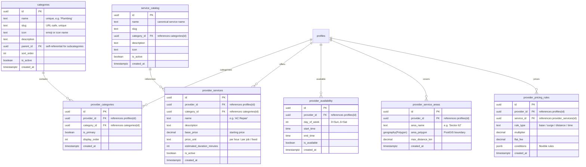
```mermaid
erDiagram
    profiles ||--o{ provider_categories : "categorised"
    profiles ||--o{ provider_services : "offers"
    profiles ||--o{ provider_availability : "available"
    profiles ||--o{ provider_service_areas : "covers"
    profiles ||--o{ provider_pricing_rules : "prices"
    categories ||--o{ provider_categories : "contains"
    service_catalog ||--o{ provider_services : "references"

    provider_categories {
        uuid id PK ""
        uuid provider_id FK "references profiles(id)"
        uuid category_id FK "references categories(id)"
        boolean is_primary ""
        int display_order ""
        timestamptz created_at ""
    }

    categories {
        uuid id PK ""
        text name "unique, e.g. 'Plumbing'"
        text slug "URL-safe, unique"
        text icon "emoji or icon name"
        text description ""
        uuid parent_id FK "self-referential for subcategories"
        int sort_order ""
        boolean is_active ""
        timestamptz created_at ""
    }

    provider_services {
        uuid id PK ""
        uuid provider_id FK "references profiles(id)"
        uuid category_id FK "references categories(id)"
        text name "e.g. 'AC Repair'"
        text description ""
        decimal base_price "starting price"
        text price_unit "per hour / per job / fixed"
        int estimated_duration_minutes ""
        boolean is_active ""
        timestamptz created_at ""
    }

    service_catalog {
        uuid id PK ""
        text name "canonical service name"
        text slug ""
        uuid category_id FK "references categories(id)"
        text description ""
        text icon ""
        boolean is_active ""
        timestamptz created_at ""
    }

    provider_availability {
        uuid id PK ""
        uuid provider_id FK "references profiles(id)"
        int day_of_week "0=Sun..6=Sat"
        time start_time ""
        time end_time ""
        boolean is_available ""
        timestamptz created_at ""
    }

    provider_service_areas {
        uuid id PK ""
        uuid provider_id FK "references profiles(id)"
        text area_name "e.g. 'Sector 62'"
        geography(Polygon) area_polygon "PostGIS boundary"
        decimal max_distance_km ""
        timestamptz created_at ""
    }

    provider_pricing_rules {
        uuid id PK ""
        uuid provider_id FK "references profiles(id)"
        uuid service_id FK "references provider_services(id)"
        text rule_type "base / surge / distance / time"
        decimal multiplier ""
        decimal flat_fee ""
        jsonb conditions "flexible rules"
        timestamptz created_at ""
    }
```

---

## 3. Provider Trust, Verification & Subscriptions


```mermaid
erDiagram
    profiles ||--|| provider_trust_signals : "has"
    profiles ||--|| provider_verification : "has"
    profiles ||--o{ provider_boosts : "purchases"
    profiles ||--o{ provider_subscriptions : "subscribes"
    profiles ||--o{ provider_analytics : "tracked"
    profiles ||--o{ provider_metrics : "scored"

    provider_trust_signals {
        uuid id PK ""
        uuid provider_id FK "unique, references profiles(id)"
        decimal trust_score "0-100 computed"
        decimal job_completion_rate "completed/accepted"
        int total_reviews ""
        decimal average_rating ""
        int repeat_clients_count ""
        int response_time_minutes ""
        int completed_jobs ""
        int accepted_jobs ""
        timestamptz last_calculated ""
        timestamptz created_at ""
    }

    provider_verification {
        uuid id PK ""
        uuid provider_id FK "unique, references profiles(id)"
        text document_type "aadhaar / pan / gst"
        text document_url "Storage path"
        text verification_status "pending / approved / rejected"
        text rejection_reason ""
        uuid reviewed_by FK "nullable, references profiles(id)"
        timestamptz reviewed_at ""
        timestamptz created_at ""
    }

    provider_boosts {
        uuid id PK ""
        uuid provider_id FK "references profiles(id)"
        text boost_type "featured / priority / spotlight"
        timestamptz start_date ""
        timestamptz end_date ""
        decimal amount "₹ paid"
        text payment_id "Razorpay order id"
        text status "active / expired / cancelled"
        timestamptz created_at ""
    }

    provider_subscriptions {
        uuid id PK ""
        uuid provider_id FK "references profiles(id)"
        text plan_name "basic / pro / enterprise"
        text status "active / cancelled / past_due"
        timestamptz current_period_start ""
        timestamptz current_period_end ""
        text payment_id "Razorpay subscription id"
        jsonb features "plan feature flags"
        timestamptz created_at ""
    }

    provider_analytics {
        uuid id PK ""
        uuid provider_id FK "references profiles(id)"
        date period_date "daily snapshot"
        int profile_views ""
        int search_impressions ""
        int listing_clicks ""
        int quote_requests ""
        int orders_received ""
        int orders_completed ""
        decimal revenue ""
        timestamptz created_at ""
    }

    provider_metrics {
        uuid id PK ""
        uuid provider_id FK "unique, references profiles(id)"
        decimal job_completion_rate ""
        int total_completed_jobs ""
        int total_accepted_jobs ""
        int repeat_clients ""
        decimal avg_response_time_minutes ""
        decimal trust_score ""
        timestamptz last_calculated ""
        timestamptz created_at ""
    }
```

---

## 4. Listings & Marketplace

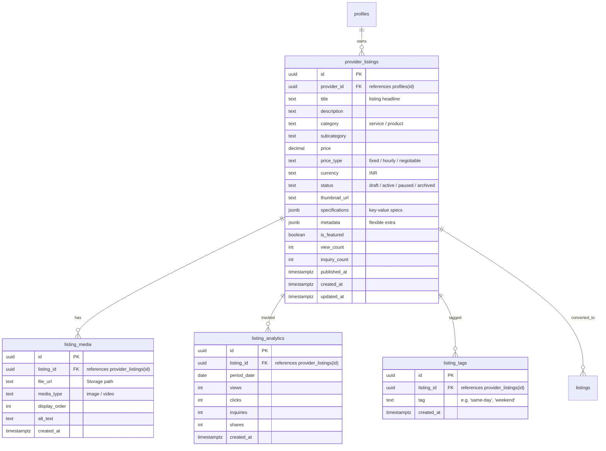
```mermaid
erDiagram
    profiles ||--o{ provider_listings : "owns"
    provider_listings ||--o{ listing_media : "has"
    provider_listings ||--o{ listing_analytics : "tracked"
    provider_listings ||--o{ listing_tags : "tagged"
    provider_listings ||--o{ listings : "converted_to"

    provider_listings {
        uuid id PK ""
        uuid provider_id FK "references profiles(id)"
        text title "listing headline"
        text description ""
        text category "service / product"
        text subcategory ""
        decimal price ""
        text price_type "fixed / hourly / negotiable"
        text currency "INR"
        text status "draft / active / paused / archived"
        text thumbnail_url ""
        jsonb specifications "key-value specs"
        jsonb metadata "flexible extra"
        boolean is_featured ""
        int view_count ""
        int inquiry_count ""
        timestamptz published_at ""
        timestamptz created_at ""
        timestamptz updated_at ""
    }

    listing_media {
        uuid id PK ""
        uuid listing_id FK "references provider_listings(id)"
        text file_url "Storage path"
        text media_type "image / video"
        int display_order ""
        text alt_text ""
        timestamptz created_at ""
    }

    listing_analytics {
        uuid id PK ""
        uuid listing_id FK "references provider_listings(id)"
        date period_date ""
        int views ""
        int clicks ""
        int inquiries ""
        int shares ""
        timestamptz created_at ""
    }

    listing_tags {
        uuid id PK ""
        uuid listing_id FK "references provider_listings(id)"
        text tag "e.g. 'same-day', 'weekend'"
        timestamptz created_at ""
    }
```

---

## 5. Orders, Cart & Payments


```mermaid
erDiagram
    profiles ||--o{ orders : "customer"
    profiles ||--o{ orders : "provider"
    orders ||--o{ order_items : "contains"
    orders ||--o{ order_status_history : "tracked"
    orders ||--o{ payments : "paid_via"
    orders ||--o{ disputes : "disputed"
    orders ||--o{ order_ratings : "rated"
    orders ||--o{ delivery_tracking : "tracked"
    orders ||--o{ escrow_transactions : "held_in"
    profiles ||--o{ cart_items : "has"
    provider_services ||--o{ cart_items : "references"
    provider_listings ||--o{ cart_items : "references"

    orders {
        uuid id PK ""
        uuid customer_id FK "references profiles(id)"
        uuid provider_id FK "references profiles(id)"
        uuid listing_id FK "references provider_listings(id)"
        text order_number "human-readable, unique"
        text status "pending / confirmed / in_progress / completed / cancelled / disputed"
        text payment_status "pending / paid / refunded / partially_refunded"
        text payment_method "razorpay / cod / wallet"
        text payment_id "Razorpay order/payment id"
        decimal total_amount ""
        decimal discount_amount ""
        decimal service_fee ""
        decimal net_amount "total - discount - service_fee"
        text currency "INR"
        text description "customer notes"
        text cancellation_reason ""
        timestamptz scheduled_date ""
        time scheduled_time ""
        text location_text "service address"
        geography(Point) location "PostGIS"
        text locality ""
        jsonb metadata "flexible"
        timestamptz confirmed_at ""
        timestamptz started_at ""
        timestamptz completed_at ""
        timestamptz cancelled_at ""
        timestamptz created_at ""
        timestamptz updated_at ""
    }

    order_items {
        uuid id PK ""
        uuid order_id FK "references orders(id)"
        uuid service_id FK "references provider_services(id)"
        uuid listing_id FK "references provider_listings(id)"
        text name "snapshot at order time"
        text description ""
        int quantity ""
        decimal unit_price ""
        decimal total_price ""
        jsonb metadata ""
        timestamptz created_at ""
    }

    order_status_history {
        uuid id PK ""
        uuid order_id FK "references orders(id)"
        text from_status ""
        text to_status ""
        text notes ""
        uuid changed_by FK "references profiles(id)"
        timestamptz changed_at ""
    }

    payments {
        uuid id PK ""
        uuid order_id FK "references orders(id)"
        text razorpay_order_id ""
        text razorpay_payment_id ""
        text razorpay_signature ""
        decimal amount ""
        text currency "INR"
        text status "created / authorized / captured / failed / refunded"
        text method "upi / card / netbanking / wallet"
        jsonb razorpay_response "full webhook payload"
        timestamptz created_at ""
        timestamptz updated_at ""
    }

    disputes {
        uuid id PK ""
        uuid order_id FK "references orders(id)"
        uuid raised_by FK "references profiles(id)"
        text reason "cancellation / quality / no_show / other"
        text description ""
        text status "open / under_review / resolved / escalated"
        text resolution ""
        uuid assigned_to FK "references profiles(id)"
        timestamptz resolved_at ""
        timestamptz created_at ""
    }

    order_ratings {
        uuid id PK ""
        uuid order_id FK "references orders(id)"
        uuid reviewer_id FK "references profiles(id)"
        uuid reviewee_id FK "references profiles(id)"
        int rating "1-5"
        text comment ""
        text response "provider reply"
        boolean is_visible ""
        timestamptz created_at ""
    }

    delivery_tracking {
        uuid id PK ""
        uuid order_id FK "references orders(id)"
        text status ""
        geography(Point) current_location ""
        text notes ""
        timestamptz timestamp ""
    }

    escrow_transactions {
        uuid id PK ""
        uuid order_id FK "references orders(id)"
        decimal amount ""
        text status "held / released / refunded"
        timestamptz held_at ""
        timestamptz released_at ""
        timestamptz created_at ""
    }

    cart_items {
        uuid id PK ""
        uuid user_id FK "references profiles(id)"
        uuid service_id FK "references provider_services(id)"
        uuid listing_id FK "references provider_listings(id)"
        int quantity ""
        text notes ""
        jsonb metadata ""
        timestamptz created_at ""
    }
```

---

## 6. Quotes

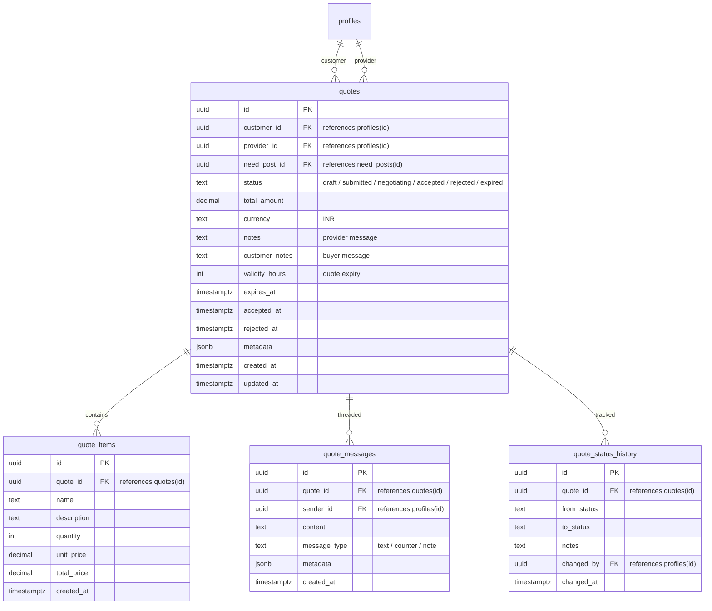
```mermaid
erDiagram
    profiles ||--o{ quotes : "customer"
    profiles ||--o{ quotes : "provider"
    quotes ||--o{ quote_items : "contains"
    quotes ||--o{ quote_messages : "threaded"
    quotes ||--o{ quote_status_history : "tracked"

    quotes {
        uuid id PK ""
        uuid customer_id FK "references profiles(id)"
        uuid provider_id FK "references profiles(id)"
        uuid need_post_id FK "references need_posts(id)"
        text status "draft / submitted / negotiating / accepted / rejected / expired"
        decimal total_amount ""
        text currency "INR"
        text notes "provider message"
        text customer_notes "buyer message"
        int validity_hours "quote expiry"
        timestamptz expires_at ""
        timestamptz accepted_at ""
        timestamptz rejected_at ""
        jsonb metadata ""
        timestamptz created_at ""
        timestamptz updated_at ""
    }

    quote_items {
        uuid id PK ""
        uuid quote_id FK "references quotes(id)"
        text name ""
        text description ""
        int quantity ""
        decimal unit_price ""
        decimal total_price ""
        timestamptz created_at ""
    }

    quote_messages {
        uuid id PK ""
        uuid quote_id FK "references quotes(id)"
        uuid sender_id FK "references profiles(id)"
        text content ""
        text message_type "text / counter / note"
        jsonb metadata ""
        timestamptz created_at ""
    }

    quote_status_history {
        uuid id PK ""
        uuid quote_id FK "references quotes(id)"
        text from_status ""
        text to_status ""
        text notes ""
        uuid changed_by FK "references profiles(id)"
        timestamptz changed_at ""
    }
```

---

## 7. Help Requests (Need Posts)

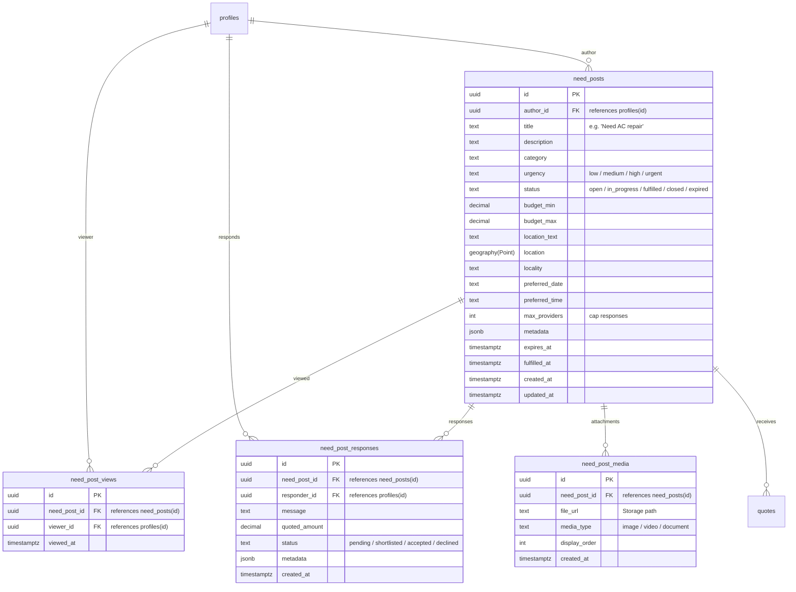
```mermaid
erDiagram
    profiles ||--o{ need_posts : "author"
    profiles ||--o{ need_post_views : "viewer"
    profiles ||--o{ need_post_responses : "responds"
    need_posts ||--o{ need_post_views : "viewed"
    need_posts ||--o{ need_post_responses : "responses"
    need_posts ||--o{ need_post_media : "attachments"
    need_posts ||--o{ quotes : "receives"

    need_posts {
        uuid id PK ""
        uuid author_id FK "references profiles(id)"
        text title "e.g. 'Need AC repair'"
        text description ""
        text category ""
        text urgency "low / medium / high / urgent"
        text status "open / in_progress / fulfilled / closed / expired"
        decimal budget_min ""
        decimal budget_max ""
        text location_text ""
        geography(Point) location ""
        text locality ""
        text preferred_date ""
        text preferred_time ""
        int max_providers "cap responses"
        jsonb metadata ""
        timestamptz expires_at ""
        timestamptz fulfilled_at ""
        timestamptz created_at ""
        timestamptz updated_at ""
    }

    need_post_views {
        uuid id PK ""
        uuid need_post_id FK "references need_posts(id)"
        uuid viewer_id FK "references profiles(id)"
        timestamptz viewed_at ""
    }

    need_post_responses {
        uuid id PK ""
        uuid need_post_id FK "references need_posts(id)"
        uuid responder_id FK "references profiles(id)"
        text message ""
        decimal quoted_amount ""
        text status "pending / shortlisted / accepted / declined"
        jsonb metadata ""
        timestamptz created_at ""
    }

    need_post_media {
        uuid id PK ""
        uuid need_post_id FK "references need_posts(id)"
        text file_url "Storage path"
        text media_type "image / video / document"
        int display_order ""
        timestamptz created_at ""
    }
```

---

## 8. Chat & Messaging

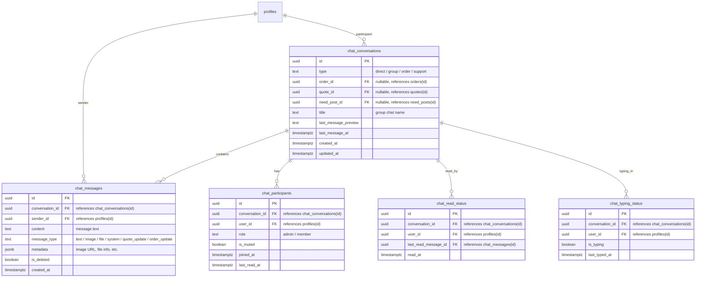
```mermaid
erDiagram
    profiles ||--o{ chat_conversations : "participant"
    profiles ||--o{ chat_messages : "sender"
    chat_conversations ||--o{ chat_messages : "contains"
    chat_conversations ||--o{ chat_participants : "has"
    chat_conversations ||--o{ chat_read_status : "read_by"
    chat_conversations ||--o{ chat_typing_status : "typing_in"

    chat_conversations {
        uuid id PK ""
        text type "direct / group / order / support"
        uuid order_id FK "nullable, references orders(id)"
        uuid quote_id FK "nullable, references quotes(id)"
        uuid need_post_id FK "nullable, references need_posts(id)"
        text title "group chat name"
        text last_message_preview ""
        timestamptz last_message_at ""
        timestamptz created_at ""
        timestamptz updated_at ""
    }

    chat_participants {
        uuid id PK ""
        uuid conversation_id FK "references chat_conversations(id)"
        uuid user_id FK "references profiles(id)"
        text role "admin / member"
        boolean is_muted ""
        timestamptz joined_at ""
        timestamptz last_read_at ""
    }

    chat_messages {
        uuid id PK ""
        uuid conversation_id FK "references chat_conversations(id)"
        uuid sender_id FK "references profiles(id)"
        text content "message text"
        text message_type "text / image / file / system / quote_update / order_update"
        jsonb metadata "image URL, file info, etc."
        boolean is_deleted ""
        timestamptz created_at ""
    }

    chat_read_status {
        uuid id PK ""
        uuid conversation_id FK "references chat_conversations(id)"
        uuid user_id FK "references profiles(id)"
        uuid last_read_message_id FK "references chat_messages(id)"
        timestamptz read_at ""
    }

    chat_typing_status {
        uuid id PK ""
        uuid conversation_id FK "references chat_conversations(id)"
        uuid user_id FK "references profiles(id)"
        boolean is_typing ""
        timestamptz last_typed_at ""
    }
```

---

## 9. Notifications

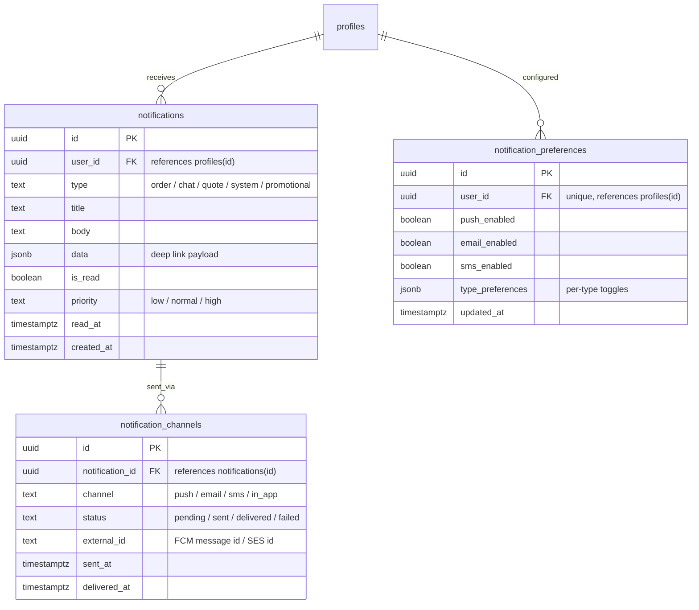
```mermaid
erDiagram
    profiles ||--o{ notifications : "receives"
    profiles ||--o{ notification_preferences : "configured"
    notifications ||--o{ notification_channels : "sent_via"

    notifications {
        uuid id PK ""
        uuid user_id FK "references profiles(id)"
        text type "order / chat / quote / system / promotional"
        text title ""
        text body ""
        jsonb data "deep link payload"
        boolean is_read ""
        text priority "low / normal / high"
        timestamptz read_at ""
        timestamptz created_at ""
    }

    notification_preferences {
        uuid id PK ""
        uuid user_id FK "unique, references profiles(id)"
        boolean push_enabled ""
        boolean email_enabled ""
        boolean sms_enabled ""
        jsonb type_preferences "per-type toggles"
        timestamptz updated_at ""
    }

    notification_channels {
        uuid id PK ""
        uuid notification_id FK "references notifications(id)"
        text channel "push / email / sms / in_app"
        text status "pending / sent / delivered / failed"
        text external_id "FCM message id / SES id"
        timestamptz sent_at ""
        timestamptz delivered_at ""
    }
```

---

## 10. Reviews & Ratings

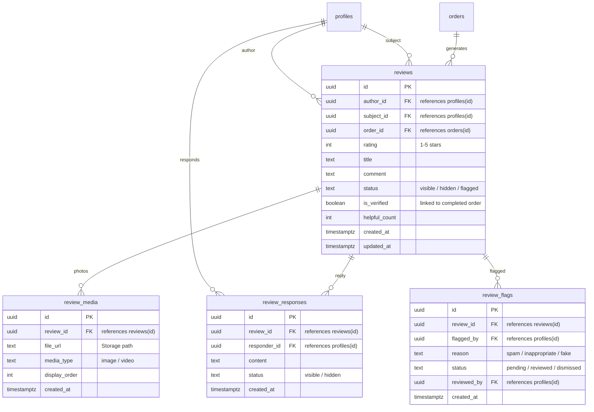
```mermaid
erDiagram
    profiles ||--o{ reviews : "author"
    profiles ||--o{ reviews : "subject"
    profiles ||--o{ review_responses : "responds"
    reviews ||--o{ review_media : "photos"
    reviews ||--o{ review_responses : "reply"
    reviews ||--o{ review_flags : "flagged"
    orders ||--o{ reviews : "generates"

    reviews {
        uuid id PK ""
        uuid author_id FK "references profiles(id)"
        uuid subject_id FK "references profiles(id)"
        uuid order_id FK "references orders(id)"
        int rating "1-5 stars"
        text title ""
        text comment ""
        text status "visible / hidden / flagged"
        boolean is_verified "linked to completed order"
        int helpful_count ""
        timestamptz created_at ""
        timestamptz updated_at ""
    }

    review_media {
        uuid id PK ""
        uuid review_id FK "references reviews(id)"
        text file_url "Storage path"
        text media_type "image / video"
        int display_order ""
        timestamptz created_at ""
    }

    review_responses {
        uuid id PK ""
        uuid review_id FK "references reviews(id)"
        uuid responder_id FK "references profiles(id)"
        text content ""
        text status "visible / hidden"
        timestamptz created_at ""
    }

    review_flags {
        uuid id PK ""
        uuid review_id FK "references reviews(id)"
        uuid flagged_by FK "references profiles(id)"
        text reason "spam / inappropriate / fake"
        text status "pending / reviewed / dismissed"
        uuid reviewed_by FK "references profiles(id)"
        timestamptz created_at ""
    }
```

---

## 11. Feed & Community

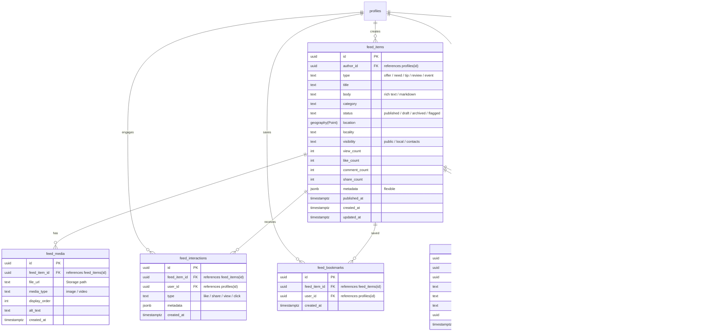
```mermaid
erDiagram
    profiles ||--o{ feed_items : "creates"
    profiles ||--o{ feed_interactions : "engages"
    profiles ||--o{ feed_bookmarks : "saves"
    profiles ||--o{ feed_reports : "reports"
    feed_items ||--o{ feed_media : "has"
    feed_items ||--o{ feed_interactions : "receives"
    feed_items ||--o{ feed_bookmarks : "saved"
    feed_items ||--o{ feed_reports : "flagged"
    feed_items ||--o{ feed_comments : "discussed"
    profiles ||--o{ feed_comments : "comments"

    feed_items {
        uuid id PK ""
        uuid author_id FK "references profiles(id)"
        text type "offer / need / tip / review / event"
        text title ""
        text body "rich text / markdown"
        text category ""
        text status "published / draft / archived / flagged"
        geography(Point) location ""
        text locality ""
        text visibility "public / local / contacts"
        int view_count ""
        int like_count ""
        int comment_count ""
        int share_count ""
        jsonb metadata "flexible"
        timestamptz published_at ""
        timestamptz created_at ""
        timestamptz updated_at ""
    }

    feed_media {
        uuid id PK ""
        uuid feed_item_id FK "references feed_items(id)"
        text file_url "Storage path"
        text media_type "image / video"
        int display_order ""
        text alt_text ""
        timestamptz created_at ""
    }

    feed_interactions {
        uuid id PK ""
        uuid feed_item_id FK "references feed_items(id)"
        uuid user_id FK "references profiles(id)"
        text type "like / share / view / click"
        jsonb metadata ""
        timestamptz created_at ""
    }

    feed_bookmarks {
        uuid id PK ""
        uuid feed_item_id FK "references feed_items(id)"
        uuid user_id FK "references profiles(id)"
        timestamptz created_at ""
    }

    feed_reports {
        uuid id PK ""
        uuid feed_item_id FK "references feed_items(id)"
        uuid reported_by FK "references profiles(id)"
        text reason "spam / inappropriate / scam / other"
        text description ""
        text status "pending / reviewed / actioned / dismissed"
        uuid reviewed_by FK "references profiles(id)"
        timestamptz created_at ""
    }

    feed_comments {
        uuid id PK ""
        uuid feed_item_id FK "references feed_items(id)"
        uuid author_id FK "references profiles(id)"
        uuid parent_id FK "self-referential for replies"
        text content ""
        boolean is_deleted ""
        timestamptz created_at ""
        timestamptz updated_at ""
    }
```

---

## 12. Workspaces & Tasks

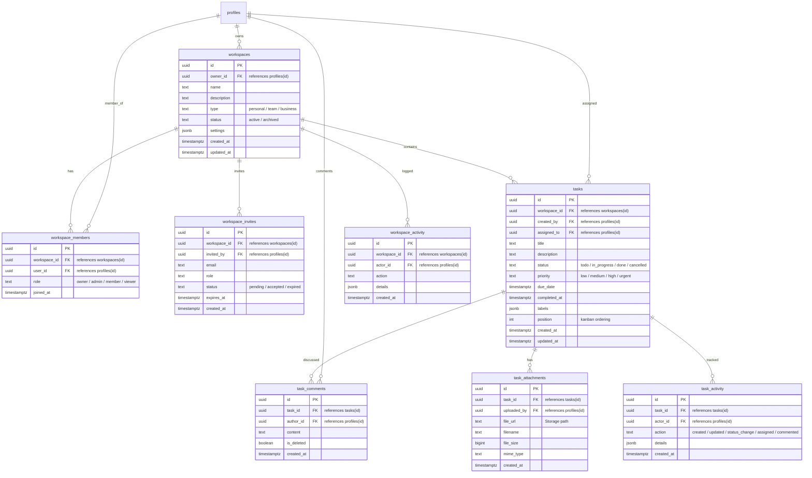
```mermaid
erDiagram
    profiles ||--o{ workspaces : "owns"
    workspaces ||--o{ workspace_members : "has"
    workspaces ||--o{ workspace_invites : "invites"
    workspaces ||--o{ tasks : "contains"
    workspaces ||--o{ workspace_activity : "logged"
    profiles ||--o{ workspace_members : "member_of"
    profiles ||--o{ tasks : "assigned"
    tasks ||--o{ task_comments : "discussed"
    tasks ||--o{ task_attachments : "has"
    tasks ||--o{ task_activity : "tracked"
    profiles ||--o{ task_comments : "comments"

    workspaces {
        uuid id PK ""
        uuid owner_id FK "references profiles(id)"
        text name ""
        text description ""
        text type "personal / team / business"
        text status "active / archived"
        jsonb settings ""
        timestamptz created_at ""
        timestamptz updated_at ""
    }

    workspace_members {
        uuid id PK ""
        uuid workspace_id FK "references workspaces(id)"
        uuid user_id FK "references profiles(id)"
        text role "owner / admin / member / viewer"
        timestamptz joined_at ""
    }

    workspace_invites {
        uuid id PK ""
        uuid workspace_id FK "references workspaces(id)"
        uuid invited_by FK "references profiles(id)"
        text email ""
        text role ""
        text status "pending / accepted / expired"
        timestamptz expires_at ""
        timestamptz created_at ""
    }

    tasks {
        uuid id PK ""
        uuid workspace_id FK "references workspaces(id)"
        uuid created_by FK "references profiles(id)"
        uuid assigned_to FK "references profiles(id)"
        text title ""
        text description ""
        text status "todo / in_progress / done / cancelled"
        text priority "low / medium / high / urgent"
        timestamptz due_date ""
        timestamptz completed_at ""
        jsonb labels ""
        int position "kanban ordering"
        timestamptz created_at ""
        timestamptz updated_at ""
    }

    task_comments {
        uuid id PK ""
        uuid task_id FK "references tasks(id)"
        uuid author_id FK "references profiles(id)"
        text content ""
        boolean is_deleted ""
        timestamptz created_at ""
    }

    task_attachments {
        uuid id PK ""
        uuid task_id FK "references tasks(id)"
        uuid uploaded_by FK "references profiles(id)"
        text file_url "Storage path"
        text filename ""
        bigint file_size ""
        text mime_type ""
        timestamptz created_at ""
    }

    task_activity {
        uuid id PK ""
        uuid task_id FK "references tasks(id)"
        uuid actor_id FK "references profiles(id)"
        text action "created / updated / status_change / assigned / commented"
        jsonb details ""
        timestamptz created_at ""
    }

    workspace_activity {
        uuid id PK ""
        uuid workspace_id FK "references workspaces(id)"
        uuid actor_id FK "references profiles(id)"
        text action ""
        jsonb details ""
        timestamptz created_at ""
    }
```

---

## 13. Referrals & Referral Rewards

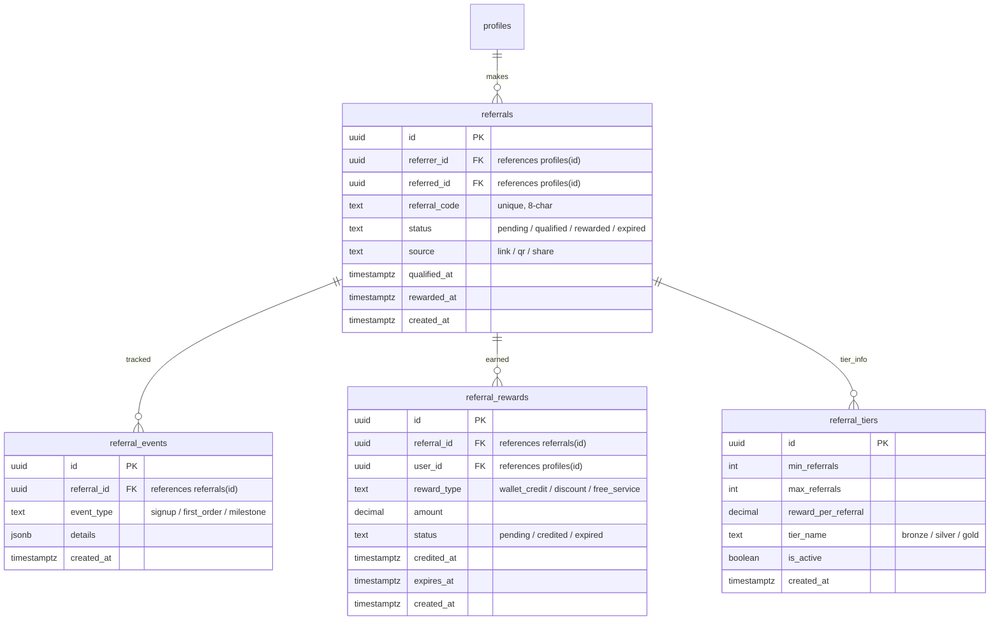
```mermaid
erDiagram
    profiles ||--o{ referrals : "makes"
    referrals ||--o{ referral_events : "tracked"
    referrals ||--o{ referral_rewards : "earned"
    referrals ||--o{ referral_tiers : "tier_info"

    referrals {
        uuid id PK ""
        uuid referrer_id FK "references profiles(id)"
        uuid referred_id FK "references profiles(id)"
        text referral_code "unique, 8-char"
        text status "pending / qualified / rewarded / expired"
        text source "link / qr / share"
        timestamptz qualified_at ""
        timestamptz rewarded_at ""
        timestamptz created_at ""
    }

    referral_events {
        uuid id PK ""
        uuid referral_id FK "references referrals(id)"
        text event_type "signup / first_order / milestone"
        jsonb details ""
        timestamptz created_at ""
    }

    referral_rewards {
        uuid id PK ""
        uuid referral_id FK "references referrals(id)"
        uuid user_id FK "references profiles(id)"
        text reward_type "wallet_credit / discount / free_service"
        decimal amount ""
        text status "pending / credited / expired"
        timestamptz credited_at ""
        timestamptz expires_at ""
        timestamptz created_at ""
    }

    referral_tiers {
        uuid id PK ""
        int min_referrals ""
        int max_referrals ""
        decimal reward_per_referral ""
        text tier_name "bronze / silver / gold"
        boolean is_active ""
        timestamptz created_at ""
    }
```

---

## 14. Geography & Market Zones

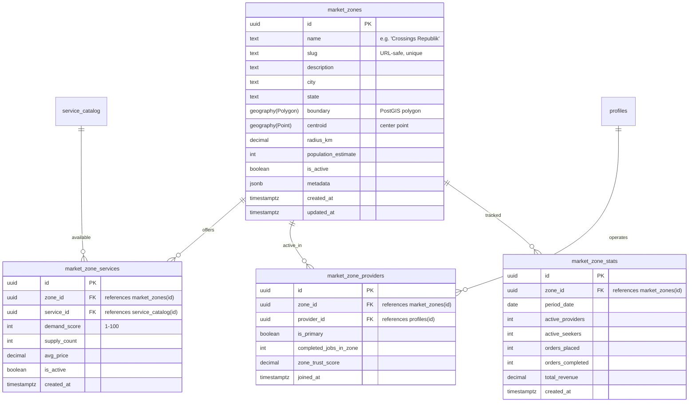
```mermaid
erDiagram
    market_zones ||--o{ market_zone_services : "offers"
    market_zones ||--o{ market_zone_providers : "active_in"
    market_zones ||--o{ market_zone_stats : "tracked"
    service_catalog ||--o{ market_zone_services : "available"
    profiles ||--o{ market_zone_providers : "operates"

    market_zones {
        uuid id PK ""
        text name "e.g. 'Crossings Republik'"
        text slug "URL-safe, unique"
        text description ""
        text city ""
        text state ""
        geography(Polygon) boundary "PostGIS polygon"
        geography(Point) centroid "center point"
        decimal radius_km ""
        int population_estimate ""
        boolean is_active ""
        jsonb metadata ""
        timestamptz created_at ""
        timestamptz updated_at ""
    }

    market_zone_services {
        uuid id PK ""
        uuid zone_id FK "references market_zones(id)"
        uuid service_id FK "references service_catalog(id)"
        int demand_score "1-100"
        int supply_count ""
        decimal avg_price ""
        boolean is_active ""
        timestamptz created_at ""
    }

    market_zone_providers {
        uuid id PK ""
        uuid zone_id FK "references market_zones(id)"
        uuid provider_id FK "references profiles(id)"
        boolean is_primary ""
        int completed_jobs_in_zone ""
        decimal zone_trust_score ""
        timestamptz joined_at ""
    }

    market_zone_stats {
        uuid id PK ""
        uuid zone_id FK "references market_zones(id)"
        date period_date ""
        int active_providers ""
        int active_seekers ""
        int orders_placed ""
        int orders_completed ""
        decimal total_revenue ""
        timestamptz created_at ""
    }
```

---

## 15. Monetization & Payments

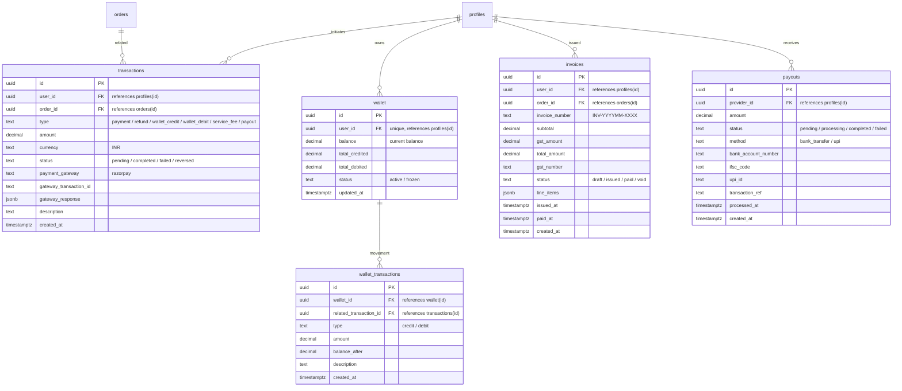
```mermaid
erDiagram
    profiles ||--o{ transactions : "initiates"
    profiles ||--o{ wallet : "owns"
    profiles ||--o{ invoices : "issued"
    profiles ||--o{ payouts : "receives"
    orders ||--o{ transactions : "related"
    wallet ||--o{ wallet_transactions : "movement"

    transactions {
        uuid id PK ""
        uuid user_id FK "references profiles(id)"
        uuid order_id FK "references orders(id)"
        text type "payment / refund / wallet_credit / wallet_debit / service_fee / payout"
        decimal amount ""
        text currency "INR"
        text status "pending / completed / failed / reversed"
        text payment_gateway "razorpay"
        text gateway_transaction_id ""
        jsonb gateway_response ""
        text description ""
        timestamptz created_at ""
    }

    wallet {
        uuid id PK ""
        uuid user_id FK "unique, references profiles(id)"
        decimal balance "current balance"
        decimal total_credited ""
        decimal total_debited ""
        text status "active / frozen"
        timestamptz updated_at ""
    }

    wallet_transactions {
        uuid id PK ""
        uuid wallet_id FK "references wallet(id)"
        uuid related_transaction_id FK "references transactions(id)"
        text type "credit / debit"
        decimal amount ""
        decimal balance_after ""
        text description ""
        timestamptz created_at ""
    }

    invoices {
        uuid id PK ""
        uuid user_id FK "references profiles(id)"
        uuid order_id FK "references orders(id)"
        text invoice_number "INV-YYYYMM-XXXX"
        decimal subtotal ""
        decimal gst_amount ""
        decimal total_amount ""
        text gst_number ""
        text status "draft / issued / paid / void"
        jsonb line_items ""
        timestamptz issued_at ""
        timestamptz paid_at ""
        timestamptz created_at ""
    }

    payouts {
        uuid id PK ""
        uuid provider_id FK "references profiles(id)"
        decimal amount ""
        text status "pending / processing / completed / failed"
        text method "bank_transfer / upi"
        text bank_account_number ""
        text ifsc_code ""
        text upi_id ""
        text transaction_ref ""
        timestamptz processed_at ""
        timestamptz created_at ""
    }
```

---

## 16. Bookings & Calendar

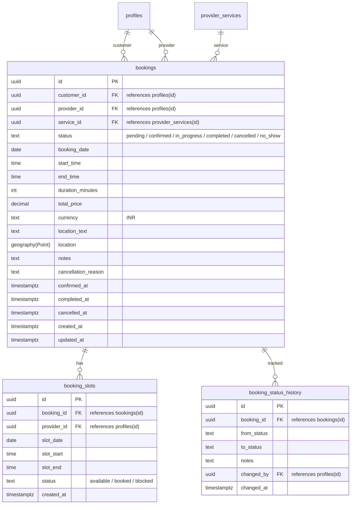
```mermaid
erDiagram
    profiles ||--o{ bookings : "customer"
    profiles ||--o{ bookings : "provider"
    bookings ||--o{ booking_slots : "has"
    bookings ||--o{ booking_status_history : "tracked"
    provider_services ||--o{ bookings : "service"

    bookings {
        uuid id PK ""
        uuid customer_id FK "references profiles(id)"
        uuid provider_id FK "references profiles(id)"
        uuid service_id FK "references provider_services(id)"
        text status "pending / confirmed / in_progress / completed / cancelled / no_show"
        date booking_date ""
        time start_time ""
        time end_time ""
        int duration_minutes ""
        decimal total_price ""
        text currency "INR"
        text location_text ""
        geography(Point) location ""
        text notes ""
        text cancellation_reason ""
        timestamptz confirmed_at ""
        timestamptz completed_at ""
        timestamptz cancelled_at ""
        timestamptz created_at ""
        timestamptz updated_at ""
    }

    booking_slots {
        uuid id PK ""
        uuid booking_id FK "references bookings(id)"
        uuid provider_id FK "references profiles(id)"
        date slot_date ""
        time slot_start ""
        time slot_end ""
        text status "available / booked / blocked"
        timestamptz created_at ""
    }

    booking_status_history {
        uuid id PK ""
        uuid booking_id FK "references bookings(id)"
        text from_status ""
        text to_status ""
        text notes ""
        uuid changed_by FK "references profiles(id)"
        timestamptz changed_at ""
    }
```

---

## 17. Disputes

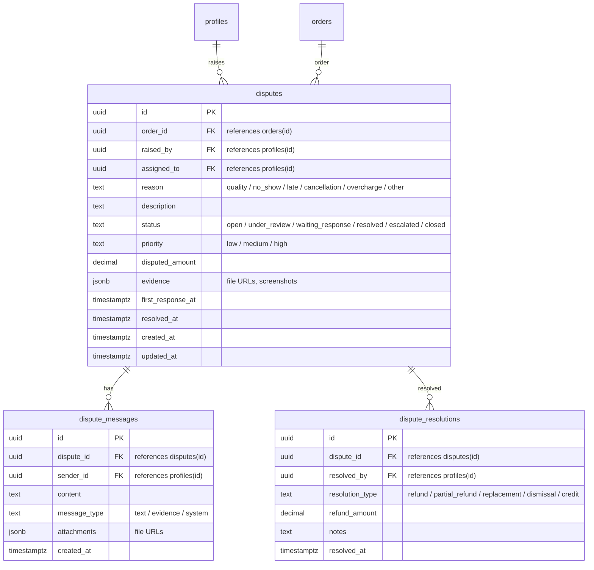
```mermaid
erDiagram
    profiles ||--o{ disputes : "raises"
    orders ||--o{ disputes : "order"
    disputes ||--o{ dispute_messages : "has"
    disputes ||--o{ dispute_resolutions : "resolved"

    disputes {
        uuid id PK ""
        uuid order_id FK "references orders(id)"
        uuid raised_by FK "references profiles(id)"
        uuid assigned_to FK "references profiles(id)"
        text reason "quality / no_show / late / cancellation / overcharge / other"
        text description ""
        text status "open / under_review / waiting_response / resolved / escalated / closed"
        text priority "low / medium / high"
        decimal disputed_amount ""
        jsonb evidence "file URLs, screenshots"
        timestamptz first_response_at ""
        timestamptz resolved_at ""
        timestamptz created_at ""
        timestamptz updated_at ""
    }

    dispute_messages {
        uuid id PK ""
        uuid dispute_id FK "references disputes(id)"
        uuid sender_id FK "references profiles(id)"
        text content ""
        text message_type "text / evidence / system"
        jsonb attachments "file URLs"
        timestamptz created_at ""
    }

    dispute_resolutions {
        uuid id PK ""
        uuid dispute_id FK "references disputes(id)"
        uuid resolved_by FK "references profiles(id)"
        text resolution_type "refund / partial_refund / replacement / dismissal / credit"
        decimal refund_amount ""
        text notes ""
        timestamptz resolved_at ""
    }
```

---

## 18. Help Requests & Support

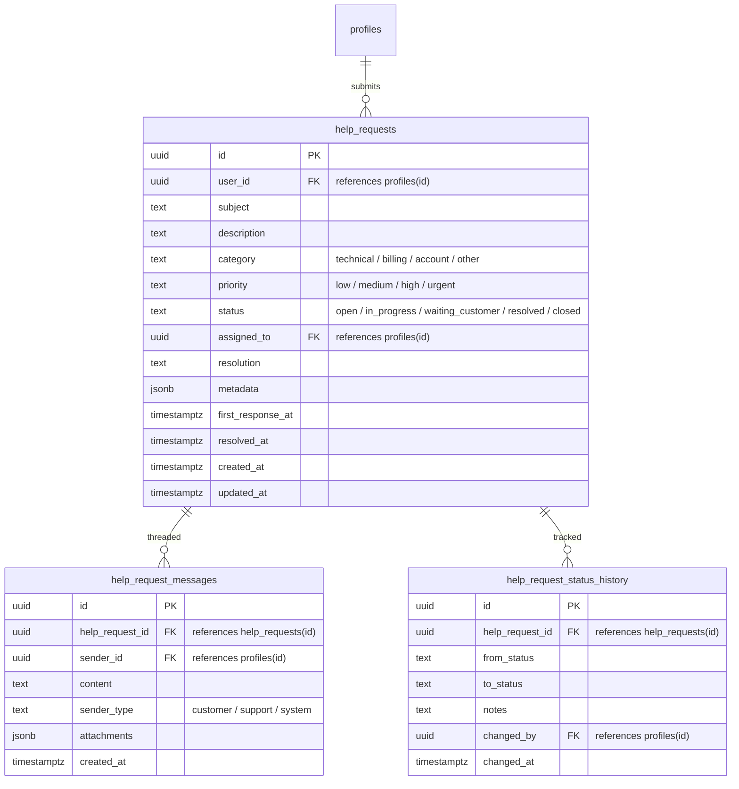
```mermaid
erDiagram
    profiles ||--o{ help_requests : "submits"
    help_requests ||--o{ help_request_messages : "threaded"
    help_requests ||--o{ help_request_status_history : "tracked"

    help_requests {
        uuid id PK ""
        uuid user_id FK "references profiles(id)"
        text subject ""
        text description ""
        text category "technical / billing / account / other"
        text priority "low / medium / high / urgent"
        text status "open / in_progress / waiting_customer / resolved / closed"
        uuid assigned_to FK "references profiles(id)"
        text resolution ""
        jsonb metadata ""
        timestamptz first_response_at ""
        timestamptz resolved_at ""
        timestamptz created_at ""
        timestamptz updated_at ""
    }

    help_request_messages {
        uuid id PK ""
        uuid help_request_id FK "references help_requests(id)"
        uuid sender_id FK "references profiles(id)"
        text content ""
        text sender_type "customer / support / system"
        jsonb attachments ""
        timestamptz created_at ""
    }

    help_request_status_history {
        uuid id PK ""
        uuid help_request_id FK "references help_requests(id)"
        text from_status ""
        text to_status ""
        text notes ""
        uuid changed_by FK "references profiles(id)"
        timestamptz changed_at ""
    }
```

---

## 19. Notifications, Campaigns & Widgets

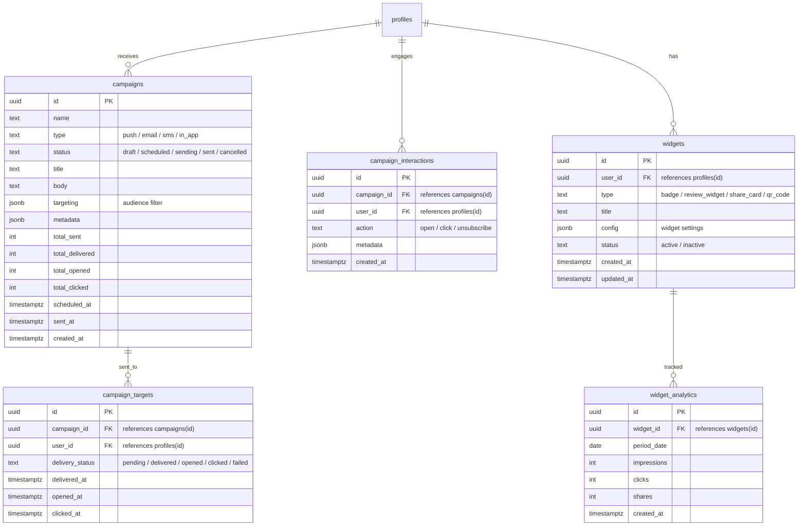
```mermaid
erDiagram
    profiles ||--o{ campaigns : "receives"
    campaigns ||--o{ campaign_targets : "sent_to"
    profiles ||--o{ campaign_interactions : "engages"
    profiles ||--o{ widgets : "has"
    widgets ||--o{ widget_analytics : "tracked"

    campaigns {
        uuid id PK ""
        text name ""
        text type "push / email / sms / in_app"
        text status "draft / scheduled / sending / sent / cancelled"
        text title ""
        text body ""
        jsonb targeting "audience filter"
        jsonb metadata ""
        int total_sent ""
        int total_delivered ""
        int total_opened ""
        int total_clicked ""
        timestamptz scheduled_at ""
        timestamptz sent_at ""
        timestamptz created_at ""
    }

    campaign_targets {
        uuid id PK ""
        uuid campaign_id FK "references campaigns(id)"
        uuid user_id FK "references profiles(id)"
        text delivery_status "pending / delivered / opened / clicked / failed"
        timestamptz delivered_at ""
        timestamptz opened_at ""
        timestamptz clicked_at ""
    }

    campaign_interactions {
        uuid id PK ""
        uuid campaign_id FK "references campaigns(id)"
        uuid user_id FK "references profiles(id)"
        text action "open / click / unsubscribe"
        jsonb metadata ""
        timestamptz created_at ""
    }

    widgets {
        uuid id PK ""
        uuid user_id FK "references profiles(id)"
        text type "badge / review_widget / share_card / qr_code"
        text title ""
        jsonb config "widget settings"
        text status "active / inactive"
        timestamptz created_at ""
        timestamptz updated_at ""
    }

    widget_analytics {
        uuid id PK ""
        uuid widget_id FK "references widgets(id)"
        date period_date ""
        int impressions ""
        int clicks ""
        int shares ""
        timestamptz created_at ""
    }
```

---

## 20. Provider Presence & Realtime

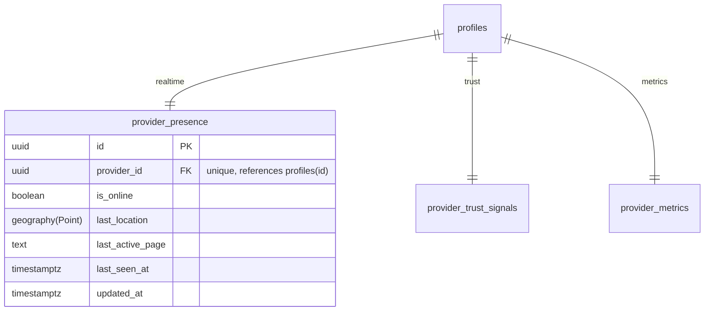
```mermaid
erDiagram
    profiles ||--|| provider_presence : "realtime"
    profiles ||--|| provider_trust_signals : "trust"
    profiles ||--|| provider_metrics : "metrics"

    provider_presence {
        uuid id PK ""
        uuid provider_id FK "unique, references profiles(id)"
        boolean is_online ""
        geography(Point) last_location ""
        text last_active_page ""
        timestamptz last_seen_at ""
        timestamptz updated_at ""
    }
```

---

## Cross-Domain Relationship Summary

```
┌─────────────────────────────────────────────────────────────────────────────┐
│                              ServiQ ER Overview                              │
├─────────────────────────────────────────────────────────────────────────────┤
│                                                                             │
│   profiles (HUB — 40+ foreign keys reference this table)                   │
│      │                                                                      │
│      ├── provider_categories ── categories                                  │
│      ├── provider_services ── service_catalog                               │
│      ├── provider_availability                                              │
│      ├── provider_service_areas                                             │
│      ├── provider_pricing_rules ── provider_services                        │
│      ├── provider_trust_signals (1:1)                                       │
│      ├── provider_verification (1:1)                                        │
│      ├── provider_boosts                                                    │
│      ├── provider_subscriptions                                             │
│      ├── provider_analytics                                                 │
│      ├── provider_metrics (1:1)                                             │
│      ├── provider_presence (1:1)                                            │
│      │                                                                      │
│      ├── provider_listings ── listing_media, listing_analytics, listing_tags│
│      │                                                                      │
│      ├── orders ── order_items, order_status_history, payments,             │
│      │             disputes, order_ratings, delivery_tracking,              │
│      │             escrow_transactions                                      │
│      │                                                                      │
│      ├── quotes ── quote_items, quote_messages, quote_status_history        │
│      │                                                                      │
│      ├── need_posts ── need_post_views, need_post_responses,                │
│      │                  need_post_media                                     │
│      │                                                                      │
│      ├── chat_conversations ── chat_messages, chat_participants,            │
│      │                         chat_read_status, chat_typing_status         │
│      │                                                                      │
│      ├── notifications ── notification_channels                             │
│      ├── notification_preferences (1:1)                                     │
│      │                                                                      │
│      ├── reviews ── review_media, review_responses, review_flags            │
│      │                                                                      │
│      ├── feed_items ── feed_media, feed_interactions, feed_bookmarks,       │
│      │                  feed_reports, feed_comments                          │
│      │                                                                      │
│      ├── workspaces ── workspace_members, workspace_invites,                │
│      │                  tasks, workspace_activity                            │
│      │                  └── tasks ── task_comments, task_attachments,       │
│      │                              task_activity                           │
│      │                                                                      │
│      ├── referrals ── referral_events, referral_rewards                     │
│      ├── referral_tiers                                                     │
│      │                                                                      │
│      ├── transactions, wallet ── wallet_transactions                        │
│      ├── invoices, payouts                                                  │
│      │                                                                      │
│      ├── bookings ── booking_slots, booking_status_history                  │
│      │                                                                      │
│      ├── market_zones ── market_zone_services, market_zone_providers,       │
│      │                    market_zone_stats                                 │
│      │                                                                      │
│      ├── disputes ── dispute_messages, dispute_resolutions                  │
│      ├── help_requests ── help_request_messages, help_request_status_history│
│      │                                                                      │
│      ├── campaigns ── campaign_targets, campaign_interactions               │
│      ├── widgets ── widget_analytics                                        │
│      │                                                                      │
│      ├── user_roles, user_sessions, user_devices,                           │
│      │   user_settings, user_privacy_settings                               │
│      │                                                                      │
│      └── cart_items                                                          │
│                                                                             │
│   Key Cross-Links:                                                          │
│      orders.customer_id ──► profiles.id                                     │
│      orders.provider_id ──► profiles.id                                     │
│      orders.listing_id  ──► provider_listings.id                            │
│      quotes.customer_id ──► profiles.id                                     │
│      quotes.provider_id ──► profiles.id                                     │
│      quotes.need_post_id ──► need_posts.id                                  │
│      chat_conversations.order_id ──► orders.id                              │
│      chat_conversations.quote_id ──► quotes.id                              │
│      chat_conversations.need_post_id ──► need_posts.id                      │
│      reviews.order_id  ──► orders.id                                        │
│      disputes.order_id ──► orders.id                                        │
│      bookings.service_id ──► provider_services.id                           │
│      market_zone_services.service_id ──► service_catalog.id                 │
│      market_zone_providers.provider_id ──► profiles.id                      │
│                                                                             │
└─────────────────────────────────────────────────────────────────────────────┘
```

---

## Cardinality Legend

| Symbol | Meaning |
|--------|---------|
| `\|\|--o{` | One-to-many (optional many) |
| `\|\|--\|\|` | One-to-one |
| `}o--o{` | Many-to-many (resolved via junction table) |
| `FK` | Foreign key |
| `PK` | Primary key |

---

*Generated from 66 Supabase migration files in `supabase/migrations/`.*
*Last updated: 2026-08-13.*
