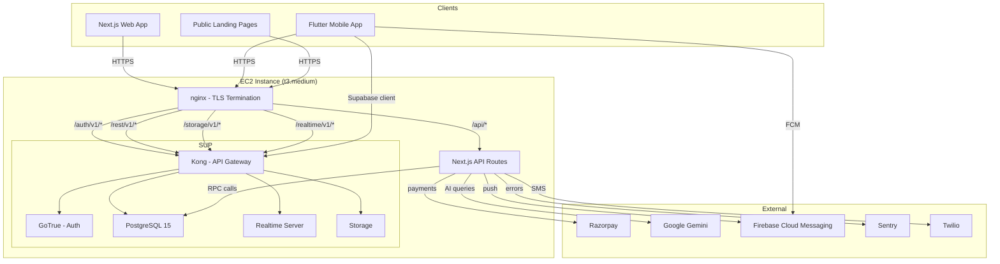

# System Architecture

## Overview

ServiQ is a hyperlocal services marketplace built with a decoupled architecture:
- **Web frontend:** Next.js 16 (App Router) on Vercel
- **Mobile app:** Flutter 3.41.x (Android + iOS)
- **Backend API:** Next.js API Routes (same codebase as web)
- **Database:** Self-hosted Supabase (PostgreSQL 15) on EC2
- **Auth:** Supabase Auth (GoTrue)
- **Payments:** Razorpay
- **AI:** Google Gemini
- **Push:** Firebase Cloud Messaging

## Architecture Diagram

## Request Flow

1. Client sends HTTPS request to `www.serviqapp.com`
2. nginx terminates TLS, routes based on path:
   - `/api/*` -> Next.js API server (port 3000)
   - `/auth/v1/*` -> Kong -> GoTrue
   - `/rest/v1/*` -> Kong -> PostgREST
   - `/storage/v1/*` -> Kong -> Storage
   - `/realtime/v1/*` -> Kong -> Realtime (websocket upgrade)
3. API routes use Supabase server client with service role for DB operations
4. RLS policies enforce data access at the database level
5. Responses returned through the same chain

## Key Design Decisions

1. **Self-hosted Supabase:** Full control over data, no vendor lock-in, single EC2 cost
2. **Next.js API routes:** Co-located with web frontend, Vercel deployment for web, EC2 for API
3. **Flutter mobile:** Single codebase for Android + iOS, Riverpod for state
4. **PostgREST + RLS:** Database-level authorization, no middleware needed
5. **Paise for money:** All monetary values stored as integers (paise) to avoid floating-point issues
6. **Dual listing system:** Legacy (`service_listings`/`product_catalog`) + V2 (`services`/`products`) for backward compatibility

## Deployment Topology

| Component | Location | Details |
|-----------|----------|---------|
| Web frontend | Vercel | Next.js 16 App Router, auto-deploys from `main` branch |
| Mobile app | Play Store / App Store | Flutter 3.41.x, built with `flutter build apk --release` |
| API server | EC2 `t3.medium` | Next.js API routes served via PM2 on port 3000 |
| Supabase | EC2 `t3.medium` | Docker Compose: Kong, GoTrue, PostgREST, Realtime, PostgreSQL |
| TLS | EC2 nginx | Let's Encrypt certificates, auto-renewal |
| CDN | Vercel Edge | Web static assets cached globally |
| Error tracking | Sentry | Both web and mobile report errors |
| Push notifications | Firebase Cloud Messaging | Android + iOS push delivery |
| AI inference | Google Gemini | Provider matching, query parsing, content generation |

## Security Architecture

- **TLS everywhere:** All client-to-server traffic encrypted via nginx
- **RLS-first authorization:** Every user-facing table has Row-Level Security policies; the application never trusts client-side role claims
- **Service role isolation:** API routes use `SUPABASE_SERVICE_ROLE_KEY` to bypass RLS when performing admin operations (order status transitions, payment verification, background jobs)
- **HMAC verification:** Razorpay webhook signatures verified with timing-safe comparison
- **Idempotent payments:** `razorpay_webhook_events` table prevents double-processing; `orders` has double-refund guard
- **Rate limiting:** `rate_limits` table with atomic upsert prevents race conditions
- **User suspension:** `is_suspended` flag on `profiles` blocks write operations via RLS policies on `orders`, `messages`, and `help_requests`
- **Content moderation:** `is_flagged`/`removed_at` on listings and posts; removed content filtered by RLS
- **Test account flagging:** `is_test` flag on profiles excludes test accounts from marketplace queries

## Scalability Notes

- Single EC2 instance currently handles all backend load
- PostgreSQL connection pooling via PgBouncer (part of Supabase stack)
- Realtime connections limited by Supabase Realtime server capacity
- No horizontal scaling yet -- the architecture supports it by adding EC2 instances behind the load balancer
- Web frontend on Vercel scales automatically
- Mobile app performance dependent on Supabase query speed and CDN caching
