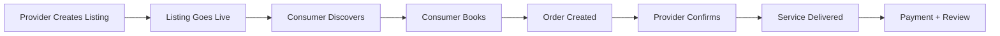
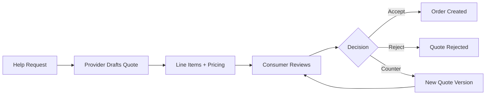

# Business Workflows

## Workflow 1: Help Request → Completed Service

```mermaid
graph LR
    A[Consumer Posts Need] --> B[AI Parses Intent]
    B --> C[Match Providers]
    C --> D[Providers Send Quotes]
    D --> E[Consumer Compares]
    E --> F[Consumer Accepts Quote]
    F --> G[Order Created]
    G --> H[Provider Accepts]
    H --> I[Service Delivered]
    I --> J[Order Completed]
    J --> K[Payment Processed]
    K --> L[Review Requested]
```

## Workflow 2: Provider Listing → Customer Booking

## Workflow 3: Quote Negotiation

## Workflow 4: Payment Flow

1. Consumer accepts quote → Order status: `accepted`
2. Razorpay order created → `razorpay_order_id` stored
3. Consumer pays via Razorpay → `razorpay_payment_id` stored
4. Webhook confirms payment → Order status: `in_progress`
5. Service completed → Order status: `completed`
6. Commission calculated → `commission_amount_paise`
7. Payout eligible → Provider requests payout

## Workflow 5: Trust Score Update

1. Order completed → Trigger fires
2. `refresh_profile_marketplace_metrics()` called
3. Fetches: avg rating, job completion rate, on-time rate, repeat clients, verification level, response time
4. Computes weighted score (0-100)
5. Updates `trust_scores` table
6. `profiles.trust_score` updated
