# ServiQ Architecture & Flows

> Complete visual reference of the system: architecture, data model, and every
> user + vendor flow. Share this doc; diagrams render natively on GitHub.
>
> Sources of truth: `docs/PRODUCT_BIBLE.md` (concepts),
> `lib/orderWorkflow.ts` (order state machine), `app/api/**` (endpoints),
> `mobile/lib/app/router/app_router.dart` (navigation).

---

## Table of contents

1. [System architecture](#1-system-architecture)
2. [Core data model](#2-core-data-model)
3. [Consumer journey, end to end](#3-consumer-journey-end-to-end)
4. [Vendor journey, end to end](#4-vendor-journey-end-to-end)
5. [AI intent engine](#5-ai-intent-engine)
6. [Need publishing and provider routing](#6-need-publishing-and-provider-routing)
7. [Quote negotiation, deal room](#7-quote-negotiation-deal-room)
8. [Order lifecycle state machine](#8-order-lifecycle-state-machine)
9. [Payment and escrow flow](#9-payment-and-escrow-flow)
10. [Chat and realtime](#10-chat-and-realtime)
11. [Trust score loop](#11-trust-score-loop)
12. [Onboarding flows](#12-onboarding-flows)

---

## 1. System architecture

Two clients (Flutter app + Next.js web) hit one Next.js API layer, which talks
to Supabase (Postgres/Auth/Realtime/Storage) and Razorpay. Supabase is
self-hosted on EC2 behind nginx TLS (`www.serviqapp.com` proxies `/rest/v1`,
`/auth/v1`, `/storage/v1`, `/realtime/v1` to Kong).

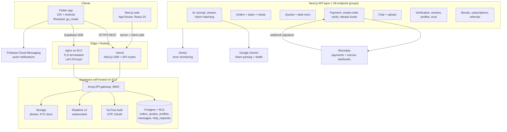

---

## 2. Core data model

Canonical entities from the Product Bible. One neighborhood graph connects
people, their work items, offerings, proposals, and trust signals.

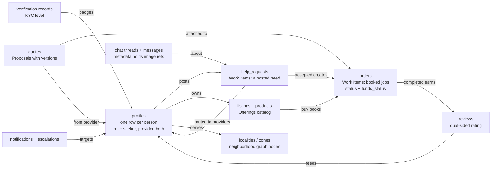

---

## 3. Consumer journey, end to end

The full happy path plus branches, from landing to review. Entry points are
the AI bar, Explore browsing, or storefront checkout.

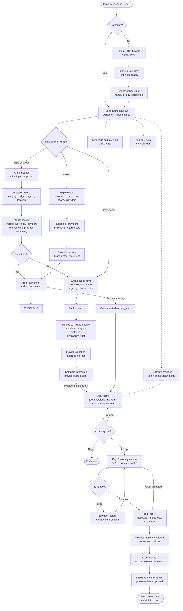

---

## 4. Vendor journey, end to end

Vendor = provider role. Same account can hold both roles; provider tools gate
on role.

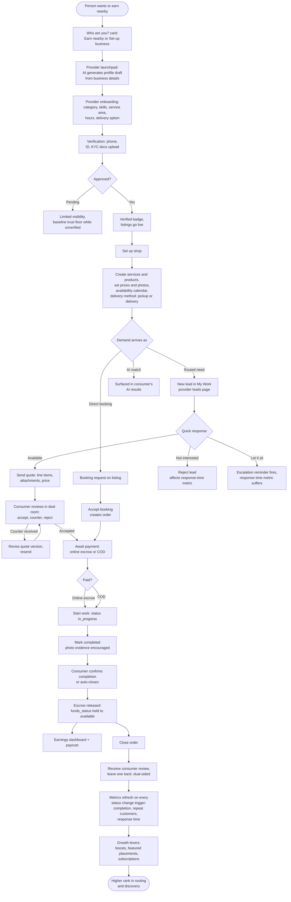

---

## 5. AI intent engine

The AI bar is the default entry. Gemini parses free text or voice into a
structured intent; the orchestrator routes to an action; matching walks the
provider graph by category, distance, availability, then trust. Falls back to
keyword search when quota is exhausted or offline.

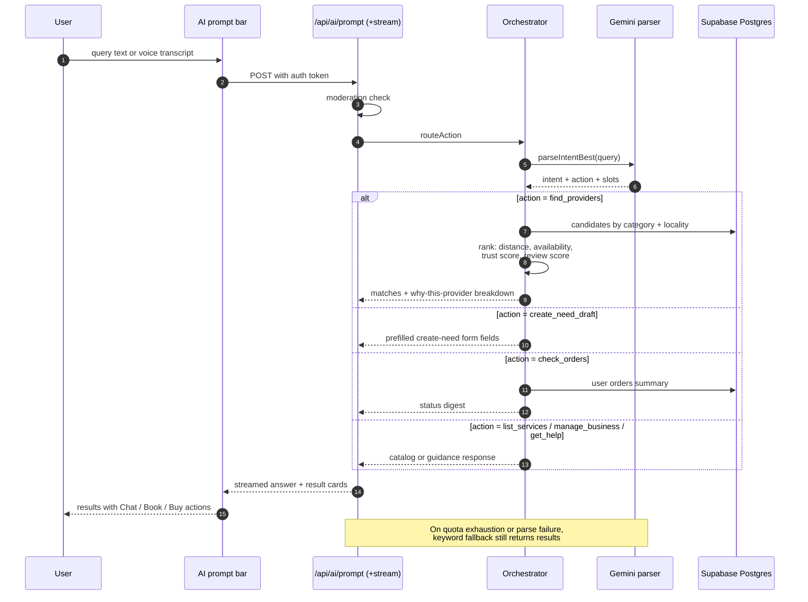

---

## 6. Need publishing and provider routing

A posted need fans out to ranked providers; interest and acceptance convert it
into an order. Escalations chase unresponsive leads.

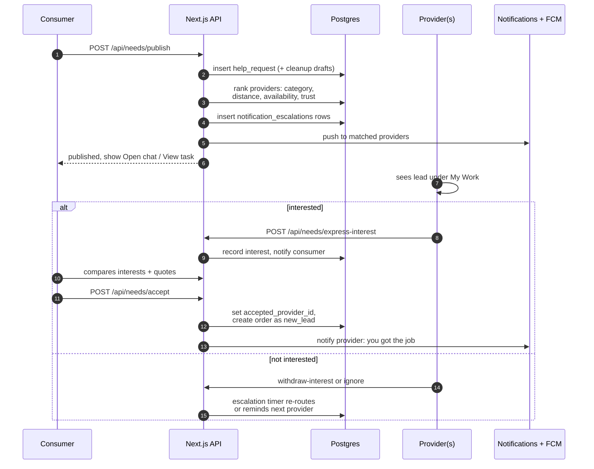

---

## 7. Quote negotiation, deal room

Quotes are versioned documents inside a deal room scoped to the order. Both
sides see task scope, budget band, timeline, and every revision.

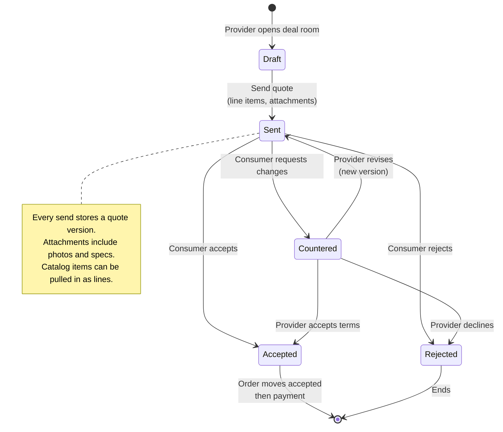

---

## 8. Order lifecycle state machine

Exact transitions enforced server-side by `canTransitionOrderStatus` in
`lib/orderWorkflow.ts`. Actor column shows who may make each move.

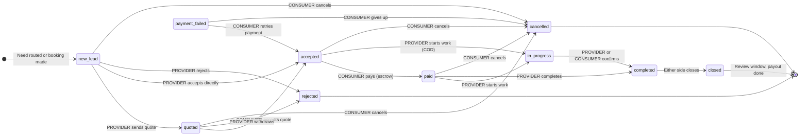

Status meanings: `new_lead` lead received · `quoted` quote sent · `accepted`
deal agreed · `paid` money in escrow · `payment_failed` retry available ·
`in_progress` work underway · `completed` awaiting close · `closed` finished ·
`countered` changes requested · `cancelled` / `rejected` terminal exits.

---

## 9. Payment and escrow flow

Razorpay handles online payment. Signature verification is timing-safe HMAC.
Funds sit as `held` in metadata until the order completes; a release job flips
them to `available`. Double-refund guard makes refund idempotent.

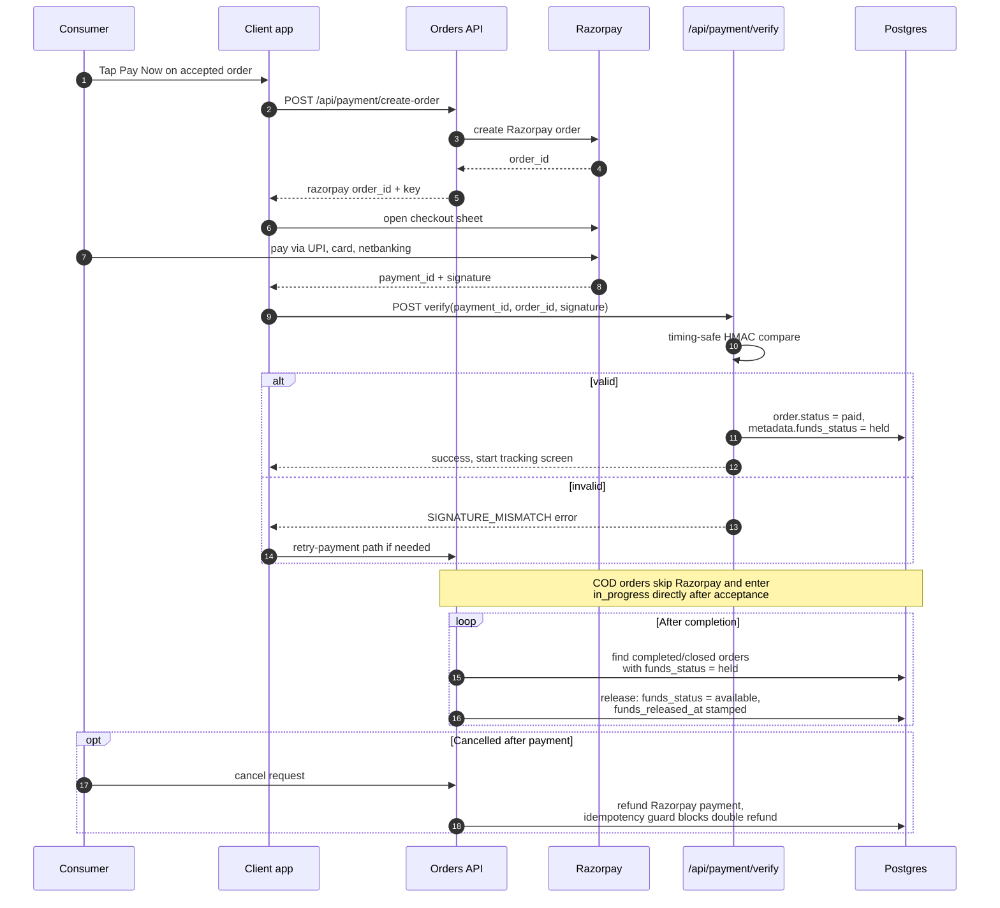

---

## 10. Chat and realtime

Chat is the coordination backbone: every need, quote, and order links to a
thread. Realtime over Supabase websockets with exponential-backoff reconnect;
images ride in message `metadata`.

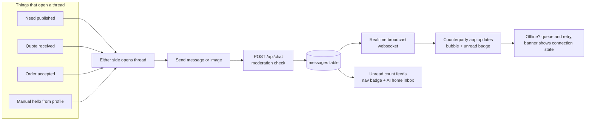

---

## 11. Trust score loop

One computed number per provider, refreshed automatically on every order
status change (`trg_orders_sync_metrics`). Six inputs; cold-start falls back
to verification baseline rather than zero.

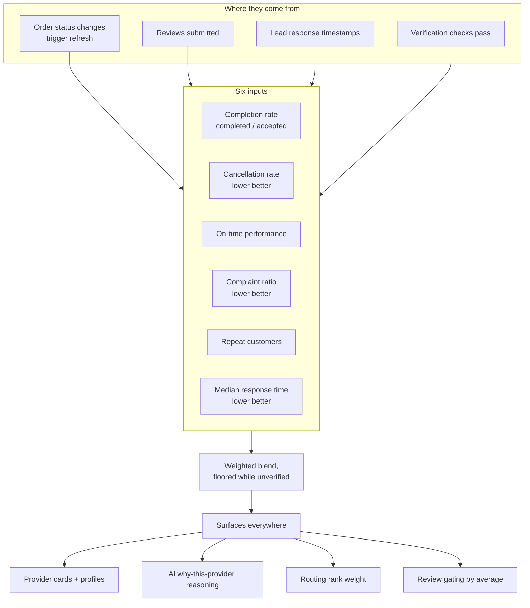

---

## 12. Onboarding flows

Single funnel, two branches. The chosen intent persists through sign-up
prefill and clears after first landing so returning users go straight home.

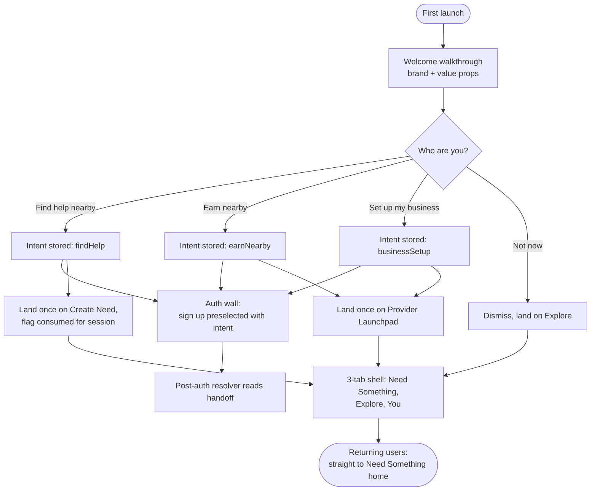

---

## Appendix: who can do what, where

Quick matrix mapping the 3-tab mental model to actions.

| Surface | Consumer actions | Vendor actions |
|---|---|---|
| **Need Something** | Ask AI, post need, catch up on inbox, track my needs | Same tabs; quick-jump to My Work leads |
| **Explore** | Browse zones, map, nearby providers, feed, storefronts | Appears in results; boosts visibility |
| **You** | Profile, orders, payments, addresses, settings | Plus: listings, availability, payouts, verification, analytics, boosts |
| **Deep pages** | Deal room, chat, order detail, checkout, public business page | Same + quote composer, lead triage |

Escalation paths: disputes and reports exist behind flags pending real
transaction volume; refunds are idempotent; support runs manual ops during
the pilot locality phase.

---

## Shareable diagram links

Every diagram as an interactive mermaid.live editor link and a direct PNG image link.

| # | Flow | Open in mermaid.live | Direct PNG |
|---|---|---|---|
| 1 | System architecture | [Edit](<https://mermaid.live/edit#pako:eJx9VWFv2zYQ_SsHfkhbRFmzAgM6YyjgOIpjJLFdSUmWSUNAS2eJi0SqRyqu13S_vSApp5E71F9End_dvbt3PH1huSqQjdi6Vpu84mQgOckkAIDuViXxtoJJLVAanWasP2Xsbw-xv7PL6yQJozRjZ3VnDBLwtv1jRW8_iEUMhzCWBSlROEskHpFaVQRQqntSnUEaxLoNT9KMzfGz-eUfDRtcOa9x20LkwAFEyHMDv_7-7IayyOQe4bAoMc2YfcBbOFfaCFkOEt2E0SS8TDN2g5Rj7dLs0sZxZGkvZ-AYDqudT2fzP9OMyVLIz6AkhJN3zju5jMEgNUJyI5R0tks0rzSEMqdta37KeLycvSjc5q75Fgle__fbe-vQKiENlKS6Vr8ZEBrP7r3zeDaCllTTmgC0IeRN4FWQBqWBhpu82m_DIjoNo7gPsKACScMhGK4f7FMiFsPqP14vknCH_9gpgxZXIK-BlGoG2OX4rgcu-bZBaUaQE3KDR8om8uQekcR6GwBhjVzj0bqTeykn5-OkjzOpuIFD6Npa8WIASqLreIe6sSFF7lSwgR8FbrTP1pJaixp1AIY6bQYhptHiNjlPM3ailDY6sNronERr4_T-hGsk4rX-qZZx1_IV1xhO3qUZ272Bxnp9VCltsOjnZpD_YjGfphm7ULJ0-pfc4IZvYfT--Ph42Nhp-jpjS6VNSa7_0WXs6Lm-6gA-OWECeC7X_dug1ry09grr9p7wU4fa3uU3L6fp2vVgqhLqEMadqZzvIlkGsLCvAyZRkmYsQl4b0SA8-ouwwZVW-QPurYk4WUSh7YdRxEv0elTKKB3Axd0ECpX_b1uj8V-LaDm-s5n4v4pavvW-fqhs_ahzUhu7LiqlHr5HmYZXs_nMlaPKGmGKjZDi5aVoOWkhSzvDxNcvGJ9NruxCE4ROu0mtugKuXAeFLD2BTlcglXketu_ecThPIss4RmnI80UiRdAoKYyi3T3sk_kNCkdHH57Ok2QZQxTGyVO_pH7EPI9UfHrx5DeSB92GJw6gkR6R4BByt68h53Wth_H82aLd5HmjC7VnsydnWk7hwM0HHECUwIFXdFeDX0MO6Nvuzf0ScPadkkNdHeFeOtCilNx0hE87zx-qt9L0Kfu4vtuZZAFrkBouCjb6wkyFjf2uFbjmXW3Y14Dxzqh4K3M2MtRhwLq24AZPBS-JN9749RsFQjTT>) | [PNG](<https://mermaid.ink/img/base64:eyJjb2RlIjoiZmxvd2NoYXJ0IFRCXG4gICAgc3ViZ3JhcGggQ2xpZW50c1tcIkNsaWVudHNcIl1cbiAgICAgICAgRkxVVFRFUltcIkZsdXR0ZXIgYXBwPGJyLz5pT1MgKyBBbmRyb2lkPGJyLz5SaXZlcnBvZCwgZ29fcm91dGVyXCJdXG4gICAgICAgIFdFQltcIk5leHQuanMgd2ViPGJyLz5BcHAgUm91dGVyLCBSZWFjdCAxOVwiXVxuICAgIGVuZFxuXG4gICAgc3ViZ3JhcGggRWRnZVtcIkVkZ2UgLyBIb3N0aW5nXCJdXG4gICAgICAgIFZFUkNFTFtcIlZlcmNlbDxici8-TmV4dC5qcyBTU1IgKyBBUEkgcm91dGVzXCJdXG4gICAgICAgIE5HSU5YW1wibmdpbnggb24gRUMyPGJyLz5UTFMgdGVybWluYXRpb248YnIvPkxldCdzIEVuY3J5cHRcIl1cbiAgICBlbmRcblxuICAgIHN1YmdyYXBoIEFQSVtcIk5leHQuanMgQVBJIGxheWVyICh-NTggZW5kcG9pbnQgZ3JvdXBzKVwiXVxuICAgICAgICBBSV9BUElbXCJBSTogcHJvbXB0LCBzdHJlYW0sPGJyLz5pbnRlbnQgbWF0Y2hpbmdcIl1cbiAgICAgICAgT1JERVJTX0FQSVtcIk9yZGVycyArIHRhc2tzICsgbmVlZHNcIl1cbiAgICAgICAgUVVPVEVTX0FQSVtcIlF1b3RlcyArIGRlYWwgcm9vbVwiXVxuICAgICAgICBQQVlfQVBJW1wiUGF5bWVudDogY3JlYXRlLW9yZGVyLDxici8-dmVyaWZ5LCByZWxlYXNlLWZ1bmRzXCJdXG4gICAgICAgIENIQVRfQVBJW1wiQ2hhdCArIHVwbG9hZFwiXVxuICAgICAgICBUUlVTVF9BUElbXCJWZXJpZmljYXRpb24sIHJldmlld3MsPGJyLz5wcm9maWxlcywgdHJ1c3RcIl1cbiAgICAgICAgR1JPV1RIW1wiQm9vc3RzLCBzdWJzY3JpcHRpb25zLDxici8-cmVmZXJyYWxzXCJdXG4gICAgZW5kXG5cbiAgICBzdWJncmFwaCBTdXBhYmFzZUVDMltcIlN1cGFiYXNlIHNlbGYtaG9zdGVkIG9uIEVDMlwiXVxuICAgICAgICBLT05HW1wiS29uZyBBUEkgZ2F0ZXdheSA6ODAwMFwiXVxuICAgICAgICBQR1soXCJQb3N0Z3JlcyArIFJMUzxici8-b3JkZXJzLCBxdW90ZXMsIHByb2ZpbGVzLDxici8-bWVzc2FnZXMsIGhlbHBfcmVxdWVzdHNcIildXG4gICAgICAgIEFVVEhbXCJHb1RydWUgQXV0aDxici8-T1RQLCBPQXV0aFwiXVxuICAgICAgICBSVFtcIlJlYWx0aW1lIHYyPGJyLz53ZWJzb2NrZXRzXCJdXG4gICAgICAgIFNUT1JFW1wiU3RvcmFnZTxici8-cGhvdG9zLCBLWUMgZG9jc1wiXVxuICAgIGVuZFxuXG4gICAgUkFaT1JQQVlbXCJSYXpvcnBheTxici8-cGF5bWVudHMgKyBlc2Nyb3cgd2ViaG9va3NcIl1cbiAgICBHRU1JTklbXCJHb29nbGUgR2VtaW5pPGJyLz5pbnRlbnQgcGFyc2luZyArIGRyYWZ0c1wiXVxuICAgIEZDTVtcIkZpcmViYXNlIENsb3VkIE1lc3NhZ2luZzxici8-cHVzaCBub3RpZmljYXRpb25zXCJdXG4gICAgU0VOVFJZW1wiU2VudHJ5PGJyLz5lcnJvciBtb25pdG9yaW5nXCJdXG5cbiAgICBGTFVUVEVSIC0tPnxIVFRQUyBSRVNUfCBWRVJDRUxcbiAgICBGTFVUVEVSIC0tPnxTdXBhYmFzZSBTREt8IE5HSU5YXG4gICAgV0VCIC0tPnxzZXJ2ZXIgKyBjbGllbnQgY2FsbHN8IFZFUkNFTFxuICAgIFZFUkNFTCAtLT4gS09OR1xuICAgIE5HSU5YIC0tPiBLT05HXG4gICAgS09ORyAtLT4gUEcgJiBBVVRIICYgUlQgJiBTVE9SRVxuXG4gICAgQUlfQVBJIC0tPiBHRU1JTklcbiAgICBQQVlfQVBJIC0tPiBSQVpPUlBBWVxuICAgIFJBWk9SUEFZIC0tPnx3ZWJob29rIHNpZ25hdHVyZXwgUEFZX0FQSVxuICAgIEZMVVRURVIgLS0-IEZDTVxuICAgIEFQSSAtLT4gU0VOVFJZXG4iLCJtZXJtYWlkIjp7InRoZW1lIjoiZGVmYXVsdCJ9fQ?type=png>) |
| 2 | Core data model | [Edit](<https://mermaid.live/edit#pako:eJx9VF1P20AQ_Cure20Q71GFhCAUqxGhJgWhuEKbu7V95ew1e-dEFPrfq_M54VN9sGTfzszu3oz8pDQbUlNVOt7qGiXAPC9aAIDLfHGWzWerQnXCpXXkv67l8IhbAuEtdCTx8dwOx8KOpuCJ7kkm0AlvrIlvaw51oX4lyfni5HieLW9XhXKs0dlgycMh_OF2VG_JVvWapWY2UAl2NbRsyA8SSeQ8XxWqJtfdCT305ENi3rDcQxao8VNA6NgHMtASmX33RX46i1wWQ_KRtGa-JwO_eZ1qPmDoPXyBsm-Nv0ufL6tkV8vs4lvcxPpg2yoiO2HT63GgRVmSDAWNAR1Xe-6Pn4tlvNeHnsO496Vwxx6dh60NNWxIvOX2pd3yPJ8dn64KpWsMEGohNLFjQ95jNYo0FNBgQKjZGQ-2wYpAqHyRyWfX2exmVSihjaVtopke3YG3hgwIxlX28OtZnp1FtzYktrQag-UWhDSLSdzvtyfgaENuz7lYLLOzVaFaDntKnJS8Rpe-Xpk5hgwODo6eCxVd84V6hvP8szJv26E63v1nEE-yoQQas7YLzQgQ7mMwAu8zOqBHlXdg1Jq6CNdCGJLukKI3GRjB6_5xyNB71OD2TjAE1PXQ_z-oUrjZj_dhuoE0IjU3naM4IaGky0kWv7Z7p0pkPu6aLN6tgKaij5gUvt0Ka-7Da48Gw8diQKkovFVQE9WQNGiNmj6pUFMT_zeGSuxdUH8nCvvAV4-tVtMgPU1U3xkMdGqxEmzS4d9_tkqDmg>) | [PNG](<https://mermaid.ink/img/base64:eyJjb2RlIjoiZmxvd2NoYXJ0IExSXG4gICAgUFJPRklMRVtcInByb2ZpbGVzPGJyLz5vbmUgcm93IHBlciBwZXJzb248YnIvPnJvbGU6IHNlZWtlciwgcHJvdmlkZXIsIGJvdGhcIl1cbiAgICBMT0NBTElUWVtcImxvY2FsaXRpZXMgLyB6b25lczxici8-bmVpZ2hib3Job29kIGdyYXBoIG5vZGVzXCJdXG5cbiAgICBIUltcImhlbHBfcmVxdWVzdHM8YnIvPldvcmsgSXRlbXM6IGEgcG9zdGVkIG5lZWRcIl1cbiAgICBPUkRFUltcIm9yZGVyczxici8-V29yayBJdGVtczogYm9va2VkIGpvYnM8YnIvPnN0YXR1cyArIGZ1bmRzX3N0YXR1c1wiXVxuICAgIExJU1RJTkdbXCJsaXN0aW5ncyArIHByb2R1Y3RzPGJyLz5PZmZlcmluZ3MgY2F0YWxvZ1wiXVxuICAgIFFVT1RFW1wicXVvdGVzPGJyLz5Qcm9wb3NhbHMgd2l0aCB2ZXJzaW9uc1wiXVxuICAgIFRIUkVBRFtcImNoYXQgdGhyZWFkcyArIG1lc3NhZ2VzPGJyLz5tZXRhZGF0YSBob2xkcyBpbWFnZSByZWZzXCJdXG4gICAgUkVWSUVXW1wicmV2aWV3czxici8-ZHVhbC1zaWRlZCByYXRpbmdcIl1cbiAgICBWRVJJRllbXCJ2ZXJpZmljYXRpb24gcmVjb3Jkczxici8-S1lDIGxldmVsXCJdXG4gICAgTk9USUZbXCJub3RpZmljYXRpb25zICsgZXNjYWxhdGlvbnNcIl1cblxuICAgIFBST0ZJTEUgLS0-fFwicG9zdHNcInwgSFJcbiAgICBQUk9GSUxFIC0tPnxcIm93bnNcInwgTElTVElOR1xuICAgIFBST0ZJTEUgLS0-fFwic2VydmVzXCJ8IExPQ0FMSVRZXG4gICAgSFIgLS0-fFwicm91dGVkIHRvIHByb3ZpZGVyc1wifCBQUk9GSUxFXG4gICAgSFIgLS0-fFwiYWNjZXB0ZWQgY3JlYXRlc1wifCBPUkRFUlxuICAgIExJU1RJTkcgLS0-fFwiYnV5IGJvb2tzXCJ8IE9SREVSXG4gICAgUVVPVEUgLS0-fFwiYXR0YWNoZWQgdG9cInwgT1JERVJcbiAgICBRVU9URSAtLT58XCJmcm9tIHByb3ZpZGVyXCJ8IFBST0ZJTEVcbiAgICBPUkRFUiAtLT58XCJjb21wbGV0ZWQgZWFybnNcInwgUkVWSUVXXG4gICAgUkVWSUVXIC0tPnxcImZlZWRzXCJ8IFBST0ZJTEVcbiAgICBWRVJJRlkgLS0-fFwiYmFkZ2VzXCJ8IFBST0ZJTEVcbiAgICBUSFJFQUQgLS0-fFwiYWJvdXRcInwgSFJcbiAgICBOT1RJRiAtLT58XCJ0YXJnZXRzXCJ8IFBST0ZJTEVcbiIsIm1lcm1haWQiOnsidGhlbWUiOiJkZWZhdWx0In19?type=png>) |
| 3 | Consumer journey end to end | [Edit](<https://mermaid.live/edit#pako:eJx1V2Fv2zYQ_SsHAgFa1F6xr8bWQbGVxItjuZKyLrAKgxZPNmeJ1EjKjhv3vw8kZUtpuk9JdHfvjnf3HpkXkkuGZESKUh7yLVUG0kkmAACSNIjTd8uMjKXQTYUKZI1CQ4Jqzz9n5Ot7GA4_wSyYT6bz25eMJHwjkAEXf2Tku8dojdbxNJcnCB7Tu_nSuwIXI4jSxQBupdyUOPhtrT5-Cuq6xAFgRXmZka9vYZ5Qn-AuegiXGZkjMkhkhWbLxQYMXXuMKWxlhfABuFjLZ1hTtkHt0DyeK8NVH82vlxm54UqboWoEKFki5FSxkUO64YLBFssaBFK1Pl4qiubXLj4Jw_swXnmYBHFn2yTWkirGxcaDCFrhAEqZ05Kb4wByanAjFW9Lcr2-wDhUe7xzrfZ393F8F03H4UtG7uQBmASzxSMIRObb7b2vrmBBzRaCEQTTYWHP5Q0-2nUwI-mxRpAKdI10l5ETBNPVdRAvMxJMoVayqg2sqXLV7yXPEbioGwO6qWupDLJL4T7Q1RdMVw9BOr5rUajSqIELg8L4PrTnPg5g3bANmgE0aoMiP_rJ2wYZLkUf2wE69DhMHmdpssxITMUOGSjUTWm0h16gdGsTFQUqLjZ6AAsl95yh0s7hwM0WDtvj0Gy5HtatDRRSLQUXm0vSNo_LuYiSdBXFq-soun_JyI1sBAMKBTfdhvd9uv20f61uZtGX_3GyXBjHYZCGq3kYTn6c3vUI1koeNP5kdtfeQE4Q_r2YRbHlQfhcl1KhJcCrVnPUA_gmhf1R0dr32W8ynHvQLWGL1-51ELtRJkhVvgVall2Eg_EF_v4rFEhNo5CBlsr0NtoCOKxJmAbT2TIj55FYpIKXCB_94Lk2lr4MDeUlfARtpMJCSdHBeQwHd-ntMiPXUu5AW0HK7UI7OMqYTcCa3ICRlswdzCW2ZVQ4vo8e0x_bPx5BLbUB6uj1kxksrNXZyKs5WrFUSA2CU6ZCqsqVZLix2_mGAM54JgHUW2mkHoBj3KXkHrxfysfr2TSxo1k065LrbVtI696aPWeix3Q6v7WckY1BZtuhPHv8Erj8l7GOegUyrg0VeSvKdE95Sdfc65dRje5a2iZxCb8E07Q3Zw1CGl5wZB4Gn2uF2ouCwh6GjXMA03kaxmHieD6WVU0VXryRvS4XqGDwbyPNK2m_uoJcij2qDY5A4EYa7lXl7fxPSbs4ayl3XGxOMAuDyco33M4yUnZZczdRBlSDwMOqRNp1-1Kvw7vst0bBtK_tBJMwmMVR9NBeZb0ULTu8eZmRCdISlJSVJ7GLhz0qzaXQAyi5QOAGK91OxRiabysURg8gl43tU48wHtZL83gcLtLV55eMBHmOtfG1dSp2dnDHGHuoHyt_5RPjP5ibE4TzySoO_7TPhNCeeYvKru77n4T4zCdYBE-ruWPvgh5HENNvUtX0CKhzJQ_uZFLBOJrAwaIBCrou-xvu4z0ZgqeV0-YFPdpGgNz1pNkZXe4byktkJ4jDNH5aZqT27qvCffftVGjUcdhaAAWrJe8pkAu9JJ1fpL1LkjR5jlqfII2D8f10ftvbyaIpC15a5DeHONmjUtccW-I5eJmRVNF8B9Juod-Is9cAuLAat7F08tVLYR8EcKDdG-WM5Ncsmod9Ca6o2mnIZVWXaM4tyM8vvVyKgququxtsuNfMWZSEHTdKqS_sdvMDhSVS7cVmj4LJbiddbHub_zUNv6zGy4zMkO4RWEPLoebMXex7jn4PnCIC2oqFFfjaMpmWvZl4GP8QjaLFO9e1RhvQub0Qm5rRy-kEPhvYc80NcA1INXd8ed8bU_vAAd2oguao-0-wX9yNEViBG2-pAfekOKuRl3mb4IPXceixs2vAXZB6oNfU6hKkQXJvxe_BP-28yFVHOEi18zmo3mmo6aa7Ibro5HGxiGJb4YTrujH23rev13a6VtBLv08umAxIhaqinJHRCzFbrOx_AgwL2pSGfB8Q2hiZHEVORkY1OCC-nRNON4pW_uP3_wCTsuyp>) | [PNG](<https://mermaid.ink/img/base64:eyJjb2RlIjoiZmxvd2NoYXJ0IFREXG4gICAgU1RBUlQoW1wiQ29uc3VtZXIgb3BlbnMgU2VydmlRXCJdKSAtLT4gTEFORElOR3tcIlNpZ25lZCBpbj9cIn1cbiAgICBMQU5ESU5HIC0tPnxOb3wgQVVUSE5bXCJTaWduIGluOiBPVFAsIEdvb2dsZSw8YnIvPkFwcGxlLCBlbWFpbFwiXVxuICAgIExBTkRJTkcgLS0-fFllc3wgSE9NRVtcIk5lZWQgU29tZXRoaW5nIHRhYjxici8-QUkgaG9tZSArIGluYm94IGJhZGdlc1wiXVxuXG4gICAgQVVUSE4gLS0-IE9OQltcIkZpcnN0LXJ1biByb2xlIGNhcmQ6PGJyLz5GaW5kIGhlbHAgbmVhcmJ5XCJdXG4gICAgT05CIC0tPiBTRUVLRVJfT05CW1wiU2Vla2VyIG9uYm9hcmRpbmc6PGJyLz5uYW1lLCBsb2NhbGl0eSwgY2F0ZWdvcmllc1wiXVxuICAgIFNFRUtFUl9PTkIgLS0-IEhPTUVcblxuICAgIEhPTUUgLS0-IENIT0lDRXtcIkhvdyBkbyB0aGV5IG5lZWQ_XCJ9XG5cbiAgICAlJSBQYXRoIEE6IEFJLWZpcnN0XG4gICAgQ0hPSUNFIC0tPnxcIlR5cGUgb3Igc3BlYWtcInwgQUlfQkFSW1wiQUkgcHJvbXB0IGJhcjxici8-dm9pY2UgaW5wdXQgc3VwcG9ydGVkXCJdXG4gICAgQUlfQkFSIC0tPiBBSV9NQVRDSFtcIkFJIHBhcnNlcyBpbnRlbnQ6PGJyLz5jYXRlZ29yeSwgYnVkZ2V0LCB1cmdlbmN5LDxici8-bG9jYXRpb25cIl1cbiAgICBBSV9NQVRDSCAtLT4gUkVTVUxUU1tcIlJhbmtlZCByZXN1bHRzOjxici8-UGVvcGxlLCBPZmZlcmluZ3MsIFByb3ZpZGVyczxici8-d2l0aCB3aHktdGhpcy1wcm92aWRlciByZWFzb25pbmdcIl1cbiAgICBSRVNVTFRTIC0tPiBQT1NUX09SX0JPT0t7XCJGb3VuZCBhIGZpdD9cIn1cbiAgICBQT1NUX09SX0JPT0sgLS0-fFllc3wgQk9PS19GTE9XXG4gICAgUE9TVF9PUl9CT09LIC0tPnxOb3wgQ1JFQVRFX05FRURcblxuICAgICUlIFBhdGggQjogYnJvd3NlXG4gICAgQ0hPSUNFIC0tPnxcIkJyb3dzZVwifCBFWFBMT1JFW1wiRXhwbG9yZSB0YWI6PGJyLz5jYXRlZ29yaWVzLCB6b25lcywgbWFwLDxici8-bmVhcmJ5IHByb3ZpZGVyc1wiXVxuICAgIEVYUExPUkUgLS0-IFNFQVJDSFtcIlNlYXJjaCBhbGwgcHJvdmlkZXJzPGJyLz5icm93c2U9MSBmZWF0dXJlZCBzb3J0XCJdXG4gICAgU0VBUkNIIC0tPiBERVRBSUxbXCJQcm92aWRlciBwcm9maWxlIC88YnIvPmxpc3RpbmcgZGV0YWlsIC8gc3RvcmVmcm9udFwiXVxuICAgIERFVEFJTCAtLT4gQk9PS19GTE9XW1wiQm9vayBzZXJ2aWNlIG9yPGJyLz5hZGQgcHJvZHVjdCB0byBjYXJ0XCJdXG4gICAgQk9PS19GTE9XIC0tPiBDSEVDS09VVFxuXG4gICAgJSUgUGF0aCBDOiBwb3N0IGEgbmVlZFxuICAgIENIT0lDRSAtLT58XCJQb3N0IG5lZWRcInwgQ1JFQVRFX05FRURbXCJDcmVhdGUgTmVlZCBmb3JtPGJyLz50aXRsZSwgY2F0ZWdvcnksIGJ1ZGdldCw8YnIvPnVyZ2VuY3ksIHBob3Rvcywgdm9pY2VcIl1cbiAgICBDUkVBVEVfTkVFRCAtLT4gUFVCTElTSFtcIlB1Ymxpc2ggbmVlZFwiXVxuICAgIFBVQkxJU0ggLS0-IFJPVVRJTkdbXCJSb3V0ZWQgdG8gcmFua2VkIG5lYXJieTxici8-cHJvdmlkZXJzOiBjYXRlZ29yeSwgZGlzdGFuY2UsPGJyLz5hdmFpbGFiaWxpdHksIHRydXN0XCJdXG4gICAgUk9VVElORyAtLT4gV0FJVFtcIlByb3ZpZGVycyBub3RpZmllZCw8YnIvPmV4cHJlc3MgaW50ZXJlc3RcIl1cbiAgICBXQUlUIC0tPiBJTlRFUkVTVFNbXCJDb21wYXJlIGludGVyZXN0ZWQ8YnIvPnByb3ZpZGVycyBhbmQgcXVvdGVzXCJdXG5cbiAgICAlJSBjb252ZXJnZTogbmVnb3RpYXRpb25cbiAgICBCT09LX0ZMT1cgLS0-fFNlcnZpY2UgYm9va2luZ3wgTEVBRF9DUkVBVEVEW1wiT3JkZXIgY3JlYXRlZCBhcyBuZXdfbGVhZFwiXVxuICAgIElOVEVSRVNUUyAtLT58UHJvdmlkZXIgc2VuZHMgcXVvdGV8IERFQUxST09NXG4gICAgTEVBRF9DUkVBVEVEIC0tPiBERUFMUk9PTVtcIkRlYWwgcm9vbTo8YnIvPnF1b3RlIHZlcnNpb25zLCBsaW5lIGl0ZW1zLDxici8-YXR0YWNobWVudHMsIGNvdW50ZXJcIl1cbiAgICBERUFMUk9PTSAtLT4gQUNDRVBUX1F7XCJBY2NlcHQgcXVvdGU_XCJ9XG4gICAgQUNDRVBUX1EgLS0-fENvdW50ZXJ8IERFQUxST09NXG4gICAgQUNDRVBUX1EgLS0-fFJlamVjdHwgRU5EX1JFSihbXCJFbmRzIGhlcmVcIl0pXG4gICAgQUNDRVBUX1EgLS0-fEFjY2VwdHwgUEFZX05PV1tcIlBheTogUmF6b3JwYXkgZXNjcm93PGJyLz5vciBDT0Qgd2hlcmUgZW5hYmxlZFwiXVxuICAgIFBBWV9OT1cgLS0-IFBBWV9PS3tcIlBheW1lbnQgb2s_XCJ9XG4gICAgUEFZX09LIC0tPnxGYWlsZWR8IFJFVFJZW1wicGF5bWVudF9mYWlsZWQsPGJyLz5yZXRyeS1wYXltZW50IGVuZHBvaW50XCJdXG4gICAgUkVUUlkgLS0-IFBBWV9OT1dcbiAgICBQQVlfT0sgLS0-fFN1Y2Nlc3N8IFRSQUNLSU5HXG5cbiAgICAlJSBmdWxmaWxtZW50XG4gICAgUEFZX05PVyAtLT58Q09EIGFjY2VwdGVkfCBUUkFDS0lOR1tcIlRyYWNrIG9yZGVyOjxici8-YWNjZXB0ZWQsIGluIHByb2dyZXNzLDxici8-b24gdGhlIHdheVwiXVxuICAgIFRSQUNLSU5HIC0tPiBET05FW1wiUHJvdmlkZXIgbWFya3MgY29tcGxldGVkLDxici8-Y29uc3VtZXIgY29uZmlybXNcIl1cbiAgICBET05FIC0tPiBDTE9TRVtcIk9yZGVyIGNsb3NlZCw8YnIvPmVzY3JvdyByZWxlYXNlZCB0byB2ZW5kb3JcIl1cbiAgICBDTE9TRSAtLT4gUkVWSUVXX0NbXCJMZWF2ZSBkdWFsLXNpZGVkIHJldmlldzxici8-cGhvdG8gZXZpZGVuY2Ugb3B0aW9uYWxcIl1cbiAgICBSRVZJRVdfQyAtLT4gTE9PUChbXCJUcnVzdCBzY29yZSB1cGRhdGVkLDxici8-bmV4dCB2aXNpdCBpcyBlYXNpZXJcIl0pXG5cbiAgICAlJSBzdXBwb3J0IHN1cmZhY2VzXG4gICAgSE9NRSAtLi0-IENIQVRbXCJDaGF0IHdpdGggcHJvdmlkZXI8YnIvPnRleHQgKyBwaG90byBhdHRhY2htZW50c1wiXVxuICAgIENIQVQgLS4tPiBERUFMUk9PTVxuICAgIEhPTUUgLS4tPiBUQVNLU1tcIk15IG5lZWRzIGFuZCBteSB3b3JrPGJyLz50YXNrcyBwYWdlXCJdXG4gICAgSE9NRSAtLi0-IFNVUFBPUlRbXCJEaXNwdXRlcywgaGVscCw8YnIvPmNhbmNlbCBvcmRlclwiXVxuIiwibWVybWFpZCI6eyJ0aGVtZSI6ImRlZmF1bHQifX0?type=png>) |
| 4 | Vendor journey end to end | [Edit](<https://mermaid.live/edit#pako:eJx1Vm1v2zYQ_isHAcNWzMG-G0MLxVYTLbbk2kqCIC4MmjxZnCVSPVI2gqT_fSApKwrQfRNE3vPcPffG14hrgdE0Kmt95hUjC8V8qwAANkW8Lv543kYrJKMVnJmyBqwGZKRAIaP9yzb6_gmurj5DmhVJVjxvo8dKAyOEF919Ac5ITP_e01-fk3cb0AQbtNC1sO-MVGjMNvoeOAOMR1zE99nsdhXPnQekT1IgQc06xauW9ahxCgdUSMyigZZ0KWsEQay0_rgk3QwcINAyWb9zDQSebrXOH3Z5dj1m02qvGQmpDoGOM4sHTS8TMEdZ12YCBukkObqI2cTfqXRHZgICa3lCegHdWqnVQHqh8ZwPyTr9-vS8jR6QZCk5c1en0FZaYUBL5xO4e5qB0NxA19aaiQEqWHug63h-k7xuo7htSZ9QfNlGP8Mlf-LuvK1QuUjeYJEu0yJxsi5kIy0KOEkj97KW9iWw7pnBWioES52xUNZaE5wrJ26nTt5XfPfjneIJjYN_SIaQUMCeiUMfTS2Nlepg4KDByeMh-mSkDx4DNklxv9oVeb7YPG-jvk5MpduBb3TDW_iv3ebepW5GyCxe0mKAKeHqQnTcmuCDQQstvR9W2ur-iJ2YrFkQAjirUQlG4WhIZ4O20mIKreTHrnWlfDkaBTN45P2bJ8s4m79uozk2jpIRyZOjNz5LweS332CBTEDLbBX-BDOv6zZa684lSqHT_Q0WiW-LDM9QOyupYPkCj5qO3tt2aBdkwkDLDjio9wF2Lgm5hb3WR6kODvk6z-_S7OZ5G12Hn0D4o0NjQSvo8_drrDiFhlleOZQ4XcbF7NYlsKOScfQucq1M1yD9bi7NS2i62ppxHSR9P66TzSr3sn3rJD-6q61WBofK7i9c2EPuanT0mySb777d50XiS0gJ-NFpi1PwRS0tNpeMW8t41aCyZhKqYojtI3ymLUhlkdDYkIJ18k8yK3aL5220xn-dik7sgFqWyK0ZXL6yskFXOST5_-Av0IK0YKR12EW6TPJ7N00Tw1ntxwIQNlK5pJaSsPf_wgAjBjBdWSKNRe2T6nWNZ7NkVexcs8ScYztkP0w43z8GNAmkUcdd9PQQWXKTF2ns1Z31OQXCk8SzcXkWyGogrZswNZmnmQDXnVNwAuT1GtAHuF6LWbgHhBzl6aL2Q7pJvNYnaTDkE05IRmo1aIFKjPR1Fh_9_TVfkCHwxI9xWuxW8VO4ehErKHc5c9KdmbTQshdXOyFMrXx1oeGkz24wzPL5KAeDddg2cepKe8XkaFa7n96nfAz1Bo_5-s4VsnXb-azpOAVjme2c2LuW9IHGK3RAmeXzYHtxwX179lm-XC0Sn78loyNw3bQ1Wgzl60cioJsgiiOg4rojdhhN_It9D5Z9TdfLcS1wrUpJjbkAS62CRASss_qK19qgGcF5BI_29T6bb0LhOxkJa2QG_br_XHZKmF0feoW1cI8R9t74PZyH8GBJvM7S7MbjMVJ-9QhmKr_V4U-XP91Z8wvL2SLfJLt8PU_WLjDn76gnerff7_QT62GXZr5GfeEO867vjX4HIjshaIWwZ_w4BdGx-spIgR9Kd5dmHnOZFOt05gJY-uZ2Q6UkNJUbx-jWTlhqQRNeMXVwW1seDkj9m2VIgWu8FpkF3hmrG6RfDZFRfD239-NmnT8Wt7t8VThfbkifbQW1c8AEmr3Wxg3REpntCAW0NeMYJmtwsdsbTtK_ht4VH-GGePN1slvH2Z17d97KQ-XUY-roxgrpzl7mlNujQhqu-837aauiSdQgNUyKaPoa2Qob96wVWLKuttHPSeRKb_OieDS11OEk6lrBLM4lOxBrws-f_wHS6571>) | [PNG](<https://mermaid.ink/img/base64:eyJjb2RlIjoiZmxvd2NoYXJ0IFREXG4gICAgU1RBUlQoW1wiUGVyc29uIHdhbnRzIHRvIGVhcm4gbmVhcmJ5XCJdKSAtLT4gSU5URU5UW1wiV2hvIGFyZSB5b3U_IGNhcmQ6PGJyLz5FYXJuIG5lYXJieSBvciBTZXQgdXAgYnVzaW5lc3NcIl1cbiAgICBJTlRFTlQgLS0-IExBVU5DSFBBRFtcIlByb3ZpZGVyIGxhdW5jaHBhZDo8YnIvPkFJIGdlbmVyYXRlcyBwcm9maWxlIGRyYWZ0PGJyLz5mcm9tIGJ1c2luZXNzIGRldGFpbHNcIl1cbiAgICBMQVVOQ0hQQUQgLS0-IFBST1ZfT05CW1wiUHJvdmlkZXIgb25ib2FyZGluZzo8YnIvPmNhdGVnb3J5LCBza2lsbHMsIHNlcnZpY2UgYXJlYSw8YnIvPmhvdXJzLCBkZWxpdmVyeSBvcHRpb25cIl1cbiAgICBQUk9WX09OQiAtLT4gVkVSSUZZW1wiVmVyaWZpY2F0aW9uOiBwaG9uZSw8YnIvPklELCBLWUMgZG9jcyB1cGxvYWRcIl1cbiAgICBWRVJJRlkgLS0-IEJBREdFe1wiQXBwcm92ZWQ_XCJ9XG4gICAgQkFER0UgLS0-fFBlbmRpbmd8IExJTUlURURbXCJMaW1pdGVkIHZpc2liaWxpdHksPGJyLz5iYXNlbGluZSB0cnVzdCBmbG9vciB3aGlsZSB1bnZlcmlmaWVkXCJdXG4gICAgQkFER0UgLS0-fFllc3wgTElWRVtcIlZlcmlmaWVkIGJhZGdlLDxici8-bGlzdGluZ3MgZ28gbGl2ZVwiXVxuXG4gICAgTElWRSAtLT4gU0VUVVBfVE9PTFNbXCJTZXQgdXAgc2hvcFwiXVxuICAgIFNFVFVQX1RPT0xTIC0tPiBUT09MU19TVUJbXCJDcmVhdGUgc2VydmljZXMgYW5kIHByb2R1Y3RzLDxici8-c2V0IHByaWNlcyBhbmQgcGhvdG9zLDxici8-YXZhaWxhYmlsaXR5IGNhbGVuZGFyLDxici8-ZGVsaXZlcnkgbWV0aG9kOiBwaWNrdXAgb3IgZGVsaXZlcnlcIl1cblxuICAgIFRPT0xTX1NVQiAtLT4gREVNQU5Ee1wiRGVtYW5kIGFycml2ZXMgYXNcIn1cblxuICAgICUlIExlYWQgcGF0aFxuICAgIERFTUFORCAtLT58XCJSb3V0ZWQgbmVlZFwifCBMRUFEW1wiTmV3IGxlYWQgaW4gTXkgV29yazxici8-cHJvdmlkZXIgbGVhZHMgcGFnZVwiXVxuICAgIERFTUFORCAtLT58XCJEaXJlY3QgYm9va2luZ1wifCBCT09LSU5HW1wiQm9va2luZyByZXF1ZXN0IG9uIGxpc3RpbmdcIl1cbiAgICBERU1BTkQgLS0-fFwiQUkgbWF0Y2hcInwgQUlNQVRDSFtcIlN1cmZhY2VkIGluIGNvbnN1bWVyJ3M8YnIvPkFJIHJlc3VsdHNcIl1cblxuICAgIExFQUQgLS0-IFJFU1BPTkR7XCJRdWljayByZXNwb25zZVwifVxuICAgIFJFU1BPTkQgLS0-fFwiQXZhaWxhYmxlXCJ8IFNFTkRfUVVPVEVbXCJTZW5kIHF1b3RlOiBsaW5lIGl0ZW1zLDxici8-YXR0YWNobWVudHMsIHByaWNlXCJdXG4gICAgUkVTUE9ORCAtLT58XCJOb3QgaW50ZXJlc3RlZFwifCBSRUpFQ1RfTFtcIlJlamVjdCBsZWFkPGJyLz5hZmZlY3RzIHJlc3BvbnNlLXRpbWUgbWV0cmljXCJdXG4gICAgUkVTUE9ORCAtLT58XCJMZXQgaXQgc2l0XCJ8IFRJTUVPVVRbXCJFc2NhbGF0aW9uIHJlbWluZGVyIGZpcmVzLDxici8-cmVzcG9uc2UgdGltZSBtZXRyaWMgc3VmZmVyc1wiXVxuXG4gICAgQk9PS0lORyAtLT4gQUNDRVBUX0JbXCJBY2NlcHQgYm9va2luZzxici8-Y3JlYXRlcyBvcmRlclwiXVxuICAgIFNFTkRfUVVPVEUgLS0-IE5FR09USUFURVtcIkNvbnN1bWVyIHJldmlld3MgaW4gZGVhbCByb29tOjxici8-YWNjZXB0LCBjb3VudGVyLCByZWplY3RcIl1cbiAgICBORUdPVElBVEUgLS0-fFwiQ291bnRlciByZWNlaXZlZFwifCBSRVZJU0VbXCJSZXZpc2UgcXVvdGUgdmVyc2lvbiw8YnIvPnJlc2VuZFwiXVxuICAgIFJFVklTRSAtLT4gTkVHT1RJQVRFXG4gICAgTkVHT1RJQVRFIC0tPnxcIkFjY2VwdGVkXCJ8IEFXQUlUX1BBWVxuICAgIEFDQ0VQVF9CIC0tPiBBV0FJVF9QQVlbXCJBd2FpdCBwYXltZW50Ojxici8-b25saW5lIGVzY3JvdyBvciBDT0RcIl1cblxuICAgIEFXQUlUX1BBWSAtLT4gUEFJRHtcIlBhaWQ_XCJ9XG4gICAgUEFJRCAtLT58T25saW5lIGVzY3Jvd3wgV09SS1tcIlN0YXJ0IHdvcms6IHN0YXR1cyBpbl9wcm9ncmVzc1wiXVxuICAgIFBBSUQgLS0-fENPRHwgV09SS1xuXG4gICAgV09SSyAtLT4gQ09NUExFVEVbXCJNYXJrIGNvbXBsZXRlZDxici8-cGhvdG8gZXZpZGVuY2UgZW5jb3VyYWdlZFwiXVxuICAgIENPTVBMRVRFIC0tPiBDT05GSVJNW1wiQ29uc3VtZXIgY29uZmlybXMgY29tcGxldGlvbjxici8-b3IgYXV0by1jbG9zZXNcIl1cbiAgICBDT05GSVJNIC0tPiBGVU5EU1tcIkVzY3JvdyByZWxlYXNlZDo8YnI-ZnVuZHNfc3RhdHVzIGhlbGQgdG8gYXZhaWxhYmxlXCJdXG4gICAgRlVORFMgLS0-IEVBUk5JTkdTW1wiRWFybmluZ3MgZGFzaGJvYXJkICsgcGF5b3V0c1wiXVxuICAgIEZVTkRTIC0tPiBDTE9TRV9PUkRFUltcIkNsb3NlIG9yZGVyXCJdXG5cbiAgICBDTE9TRV9PUkRFUiAtLT4gUkVWX0lOW1wiUmVjZWl2ZSBjb25zdW1lciByZXZpZXcsPGJyLz5sZWF2ZSBvbmUgYmFjazogZHVhbC1zaWRlZFwiXVxuICAgIFJFVl9JTiAtLT4gTUVUUklDU1tcIk1ldHJpY3MgcmVmcmVzaCBvbiBldmVyeTxici8-c3RhdHVzIGNoYW5nZSB0cmlnZ2VyOjxici8-Y29tcGxldGlvbiwgcmVwZWF0IGN1c3RvbWVycyw8YnIvPnJlc3BvbnNlIHRpbWVcIl1cblxuICAgIE1FVFJJQ1MgLS0-IEdST1dUSF9PUFRTW1wiR3Jvd3RoIGxldmVyczo8YnIvPmJvb3N0cywgZmVhdHVyZWQgcGxhY2VtZW50cyw8YnIvPnN1YnNjcmlwdGlvbnNcIl1cbiAgICBHUk9XVEhfT1BUUyAtLT4gTU9SRV9SQU5LKFtcIkhpZ2hlciByYW5rIGluIHJvdXRpbmc8YnIvPmFuZCBkaXNjb3ZlcnlcIl0pXG4iLCJtZXJtYWlkIjp7InRoZW1lIjoiZGVmYXVsdCJ9fQ?type=png>) |
| 5 | AI intent engine | [Edit](<https://mermaid.live/edit#pako:eJx1VE1vIjEM_SvWnLoCxH20OxJsJcRli9TlhoQ8iWEiMsnUdqCo6n9fhRnYqqWnKPbzx3ux81aYaKkoC6GXRMHQo8M9Y7sJAACYNIbU1sT9vUNWZ1yHQWENKLCWe645cnbOltBxbDuFGu-gZqtlRk2xc1N00wH6MBJlwvbH14AnNk2OyCeJMmq8k3aRIQtqXXDZfrfBx3kGPacOaxSCVRTdM8km9ND1pKrmyCW8JOIzKL0qRIZjdIZAGYMYdp324DnypKpmq2UJq6fnv3By2mThGtB4oCHjbLW8gtpoiVFdDGAaMoePgMysBI5JaWYypHdm86SqFmVPaBmUgs5J9OHS4CDVYnLL4C4IGAFessAIxEe98UOvV88v2Llgtx3Ho7PE0gM-FH2cl2AwWGdRSaA-g0GlfeQzjMBHg97p-UvUQATDoQTrRDEYGgMe0XmsXQ4Z_6x5WiknURATmcbAdHR06m-fMt7EQ81vDyM4NeeJNk4m19ahZsKDjaeBJHmh_ywNEyptA5HdWsadflOgY9o578kOEZMcAbvILewceSt3k-d33Eb-VsAkxND7QVLbIn-W7FpfFDUJWLcn0Xu1vBPdCvHRGRKYQosB97Stk7hAki170m1DvvumgkFFH_d5oPfJ2fwywCRdDDKoTsFuPsztdRn6vSQLGOREDKMclryCQb7qkpdhUlXrcvBJvw6_G1SYwjzGQz7SeeBzm8g_UQnikThXHC9KeArwkqIi0GuDSS7kI_fzDzt0PjH1I3Sg8ymyhR16X6M5gKjzHpg0cZBrH5tQjIuWuEVni_Kt0Iba_O1Z2mHyWryPi_zZPZ-DKUrlROMidXnkh_-wN77_A8y5u7Y>) | [PNG](<https://mermaid.ink/img/base64:eyJjb2RlIjoic2VxdWVuY2VEaWFncmFtXG4gICAgYXV0b251bWJlclxuICAgIHBhcnRpY2lwYW50IFUgYXMgVXNlclxuICAgIHBhcnRpY2lwYW50IEJhciBhcyBBSSBwcm9tcHQgYmFyXG4gICAgcGFydGljaXBhbnQgQVBJIGFzIC9hcGkvYWkvcHJvbXB0ICgrc3RyZWFtKVxuICAgIHBhcnRpY2lwYW50IE9yY2ggYXMgT3JjaGVzdHJhdG9yXG4gICAgcGFydGljaXBhbnQgRyBhcyBHZW1pbmkgcGFyc2VyXG4gICAgcGFydGljaXBhbnQgREIgYXMgU3VwYWJhc2UgUG9zdGdyZXNcblxuICAgIFUtPj5CYXI6IHF1ZXJ5IHRleHQgb3Igdm9pY2UgdHJhbnNjcmlwdFxuICAgIEJhci0-PkFQSTogUE9TVCB3aXRoIGF1dGggdG9rZW5cbiAgICBBUEktPj5BUEk6IG1vZGVyYXRpb24gY2hlY2tcbiAgICBBUEktPj5PcmNoOiByb3V0ZUFjdGlvblxuICAgIE9yY2gtPj5HOiBwYXJzZUludGVudEJlc3QocXVlcnkpXG4gICAgRy0tPj5PcmNoOiBpbnRlbnQgKyBhY3Rpb24gKyBzbG90c1xuXG4gICAgYWx0IGFjdGlvbiA9IGZpbmRfcHJvdmlkZXJzXG4gICAgICAgIE9yY2gtPj5EQjogY2FuZGlkYXRlcyBieSBjYXRlZ29yeSArIGxvY2FsaXR5XG4gICAgICAgIE9yY2gtPj5PcmNoOiByYW5rOiBkaXN0YW5jZSwgYXZhaWxhYmlsaXR5LDxici8-dHJ1c3Qgc2NvcmUsIHJldmlldyBzY29yZVxuICAgICAgICBPcmNoLS0-PkFQSTogbWF0Y2hlcyArIHdoeS10aGlzLXByb3ZpZGVyIGJyZWFrZG93blxuICAgIGVsc2UgYWN0aW9uID0gY3JlYXRlX25lZWRfZHJhZnRcbiAgICAgICAgT3JjaC0tPj5BUEk6IHByZWZpbGxlZCBjcmVhdGUtbmVlZCBmb3JtIGZpZWxkc1xuICAgIGVsc2UgYWN0aW9uID0gY2hlY2tfb3JkZXJzXG4gICAgICAgIE9yY2gtPj5EQjogdXNlciBvcmRlcnMgc3VtbWFyeVxuICAgICAgICBPcmNoLS0-PkFQSTogc3RhdHVzIGRpZ2VzdFxuICAgIGVsc2UgYWN0aW9uID0gbGlzdF9zZXJ2aWNlcyAvIG1hbmFnZV9idXNpbmVzcyAvIGdldF9oZWxwXG4gICAgICAgIE9yY2gtLT4-QVBJOiBjYXRhbG9nIG9yIGd1aWRhbmNlIHJlc3BvbnNlXG4gICAgZW5kXG5cbiAgICBBUEktLT4-QmFyOiBzdHJlYW1lZCBhbnN3ZXIgKyByZXN1bHQgY2FyZHNcbiAgICBCYXItLT4-VTogcmVzdWx0cyB3aXRoIENoYXQgLyBCb29rIC8gQnV5IGFjdGlvbnNcblxuICAgIE5vdGUgb3ZlciBBUEksRzogT24gcXVvdGEgZXhoYXVzdGlvbiBvciBwYXJzZSBmYWlsdXJlLDxici8-a2V5d29yZCBmYWxsYmFjayBzdGlsbCByZXR1cm5zIHJlc3VsdHNcbiIsIm1lcm1haWQiOnsidGhlbWUiOiJkZWZhdWx0In19?type=png>) |
| 6 | Need publishing and routing | [Edit](<https://mermaid.live/edit#pako:eJx9VMFOGzEQ_ZXRnqjYNPdVtRIkqsSBsBJVe0GKJvaQNezaZmZMiBD_XjmbTaCkHD3z3vi955FfCxMsFVUh9JTIG5o7XDP2dx4AAJMGn_oV8XCOyOqMi-gVZoACs-Al9afaF81VBizoRb8_SD5-xswvM6QJomsm-dxvdm0Oz84Sn8m3z4jF7o6g7t4ZVBe8wDn8nF3f-QE7m9T1RXNVQXNz-wumGN3UE1mZxrTqnLQD6qK5mtT1_LIC54VYoaUuLjknIgpn52A6Qp8iWMZ7HXUcWYz-EeJep1RgUGkdeFv-WPG0tk4UvaES8BldhyvXOd2WoJxE_yPAv7O0JDHY7d1x2Mh7zqKCmKQFDdCjmpbsUcgRN6nrWQbuPJMtQdqwgZtIHkyLClP47WgDivI4JtdM6rqpQIgEOkILyVtiuN7Cn8CP-_XoFJxXYhIlO9RG7snU6SUyiUxG0pHyLkwyge1hbjlksQXzYdU-PK4JfUQmOZDyFjyloONSfbkKaAzFk1KEFIYu2eUY69LZ4V0NEypB4JwLCnjaLHNS_05aVKOFcUQF25BgHRS0JXgIq4FCnVCGfp3pxmlrGTeHECEwuLUPTKc8HJcH1PXEwDThkJRkZyLkQu-8zfpf9CBxr8jbO1-URU_co7NF9VpoS33-LyzdY-q0eCuL_Evcbr0pKuVEZZGiRR0_kqH49hfcY3MT>) | [PNG](<https://mermaid.ink/img/base64:eyJjb2RlIjoic2VxdWVuY2VEaWFncmFtXG4gICAgYXV0b251bWJlclxuICAgIHBhcnRpY2lwYW50IEMgYXMgQ29uc3VtZXJcbiAgICBwYXJ0aWNpcGFudCBBUEkgYXMgTmV4dC5qcyBBUElcbiAgICBwYXJ0aWNpcGFudCBEQiBhcyBQb3N0Z3Jlc1xuICAgIHBhcnRpY2lwYW50IFAgYXMgUHJvdmlkZXIocylcbiAgICBwYXJ0aWNpcGFudCBOIGFzIE5vdGlmaWNhdGlvbnMgKyBGQ01cblxuICAgIEMtPj5BUEk6IFBPU1QgL2FwaS9uZWVkcy9wdWJsaXNoXG4gICAgQVBJLT4-REI6IGluc2VydCBoZWxwX3JlcXVlc3QgKCsgY2xlYW51cCBkcmFmdHMpXG4gICAgQVBJLT4-REI6IHJhbmsgcHJvdmlkZXJzOiBjYXRlZ29yeSw8YnIvPmRpc3RhbmNlLCBhdmFpbGFiaWxpdHksIHRydXN0XG4gICAgQVBJLT4-REI6IGluc2VydCBub3RpZmljYXRpb25fZXNjYWxhdGlvbnMgcm93c1xuICAgIEFQSS0-Pk46IHB1c2ggdG8gbWF0Y2hlZCBwcm92aWRlcnNcbiAgICBBUEktLT4-QzogcHVibGlzaGVkLCBzaG93IE9wZW4gY2hhdCAvIFZpZXcgdGFza1xuXG4gICAgUC0-PlA6IHNlZXMgbGVhZCB1bmRlciBNeSBXb3JrXG4gICAgYWx0IGludGVyZXN0ZWRcbiAgICAgICAgUC0-PkFQSTogUE9TVCAvYXBpL25lZWRzL2V4cHJlc3MtaW50ZXJlc3RcbiAgICAgICAgQVBJLT4-REI6IHJlY29yZCBpbnRlcmVzdCwgbm90aWZ5IGNvbnN1bWVyXG4gICAgICAgIEMtPj5BUEk6IGNvbXBhcmVzIGludGVyZXN0cyArIHF1b3Rlc1xuICAgICAgICBDLT4-QVBJOiBQT1NUIC9hcGkvbmVlZHMvYWNjZXB0XG4gICAgICAgIEFQSS0-PkRCOiBzZXQgYWNjZXB0ZWRfcHJvdmlkZXJfaWQsPGJyLz5jcmVhdGUgb3JkZXIgYXMgbmV3X2xlYWRcbiAgICAgICAgQVBJLT4-Tjogbm90aWZ5IHByb3ZpZGVyOiB5b3UgZ290IHRoZSBqb2JcbiAgICBlbHNlIG5vdCBpbnRlcmVzdGVkXG4gICAgICAgIFAtPj5BUEk6IHdpdGhkcmF3LWludGVyZXN0IG9yIGlnbm9yZVxuICAgICAgICBBUEktPj5EQjogZXNjYWxhdGlvbiB0aW1lciByZS1yb3V0ZXM8YnIvPm9yIHJlbWluZHMgbmV4dCBwcm92aWRlclxuICAgIGVuZFxuIiwibWVybWFpZCI6eyJ0aGVtZSI6ImRlZmF1bHQifX0?type=png>) |
| 7 | Quote negotiation deal room | [Edit](<https://mermaid.live/edit#pako:eJxtkkFv2zAMhf8KodNaJCuwozEUKNKeN7THpgdVeok1WJQrUh6Cov99kB3bXVAddCDeJ71H8t245GEaI2oV98Ees43b4ceeiYier19ou72l-2wP2tDvnIbgkSn1YCEP21FOKe55ko-yEXgCa1NvT28lKX6-5pvbb11gUFBE2ZBVta6NYJWrma_UiN85h17hG9ollhKRyY4luRDuUmFF_k-Z8VYgKuRay0dcIo_4A6cXRC3JbGN59FOUJXrGEAQyBWL8pQFZQuKrr9j1r4X3cLUN8pV8jb3Iz7FJkeNicNaN0PP1S0O_chXHNEDOCPxoUVsw9fZUGz3Bs6cVfmC_PM1JQTkcW6V0GLNP9XoeBuQTSR2qaMr1q2m6cw--r9q7dbwU2HXFg_o2aRKyle_h5JN8Z9V26TgtBznL9ArqS9fBU2CyQmPTzkR1UI3u2WxMRI42eNO8G20R6y57HGzp1HxsjC2ank7sTKO5YGNK79c9n4of_wBpaAJB>) | [PNG](<https://mermaid.ink/img/base64:eyJjb2RlIjoic3RhdGVEaWFncmFtLXYyXG4gICAgWypdIC0tPiBEcmFmdDogUHJvdmlkZXIgb3BlbnMgZGVhbCByb29tXG5cbiAgICBEcmFmdCAtLT4gU2VudDogU2VuZCBxdW90ZTxici8-KGxpbmUgaXRlbXMsIGF0dGFjaG1lbnRzKVxuXG4gICAgU2VudCAtLT4gQWNjZXB0ZWQ6IENvbnN1bWVyIGFjY2VwdHNcbiAgICBTZW50IC0tPiBDb3VudGVyZWQ6IENvbnN1bWVyIHJlcXVlc3RzIGNoYW5nZXNcbiAgICBTZW50IC0tPiBSZWplY3RlZDogQ29uc3VtZXIgcmVqZWN0c1xuXG4gICAgQ291bnRlcmVkIC0tPiBTZW50OiBQcm92aWRlciByZXZpc2VzPGJyLz4obmV3IHZlcnNpb24pXG4gICAgQ291bnRlcmVkIC0tPiBSZWplY3RlZDogUHJvdmlkZXIgZGVjbGluZXNcbiAgICBDb3VudGVyZWQgLS0-IEFjY2VwdGVkOiBQcm92aWRlciBhY2NlcHRzIHRlcm1zXG5cbiAgICBBY2NlcHRlZCAtLT4gWypdOiBPcmRlciBtb3ZlcyBhY2NlcHRlZDxici8-dGhlbiBwYXltZW50XG4gICAgUmVqZWN0ZWQgLS0-IFsqXTogRW5kc1xuXG4gICAgbm90ZSByaWdodCBvZiBTZW50XG4gICAgICAgIEV2ZXJ5IHNlbmQgc3RvcmVzIGEgcXVvdGUgdmVyc2lvbi5cbiAgICAgICAgQXR0YWNobWVudHMgaW5jbHVkZSBwaG90b3MgYW5kIHNwZWNzLlxuICAgICAgICBDYXRhbG9nIGl0ZW1zIGNhbiBiZSBwdWxsZWQgaW4gYXMgbGluZXMuXG4gICAgZW5kIG5vdGVcbiIsIm1lcm1haWQiOnsidGhlbWUiOiJkZWZhdWx0In19?type=png>) |
| 8 | Order lifecycle state machine | [Edit](<https://mermaid.live/edit#pako:eJyNlLFOwzAQhl_l5AmqdmHMwEI7IAFFqWABVBn72hoSX7hzGlWId0ep65KWVOr65_vj7-zE38qQRZUpCTrg2Okl63K0vnr1AADWMZrgyMNd_upj9jJ4g9HoGjw28wK1zeAB0QJTHdACMbwTfTq_hFJbTKUEb5tfNQW0GTzm0-fb8SQHQW8lxj24Ngarw0KMZOdXbHpajB9oDlsxkh7YaG-wKFr6Zvowe7qf5LtM0gRR-khoDyehzgydQo9L48LKsm7kH3yGSxLY8pV2XbTSG4ELFMPUXPbgzs8rpiWjSPcEguYg0BB_wsXNdNzXPEOsdTlvlSPeUFkVeLhFKZNj9hyPTYk-zBfaFacPjTGwQ0n0yWrfgku3RoG6Sit2Bj45EHFHmPzCcbk33vOxXZC01YkLK2QQZzFmu72Iz7foy-AtgxzXDhtonLfUDNsZqA5gye9_wPQJps7uPWmyv1gNVYlcamdV9q3CCsv2drC40HUR1M9Q6TrQbOONygLXOFR1Zf9ujhj-_AIYRWtd>) | [PNG](<https://mermaid.ink/img/base64:eyJjb2RlIjoic3RhdGVEaWFncmFtLXYyXG4gICAgZGlyZWN0aW9uIExSXG5cbiAgICBbKl0gLS0-IG5ld19sZWFkOiBOZWVkIHJvdXRlZCBvciBib29raW5nIG1hZGVcblxuICAgIG5ld19sZWFkIC0tPiBxdW90ZWQ6IFBST1ZJREVSIHNlbmRzIHF1b3RlXG4gICAgbmV3X2xlYWQgLS0-IGFjY2VwdGVkOiBQUk9WSURFUiBhY2NlcHRzIGRpcmVjdGx5XG4gICAgbmV3X2xlYWQgLS0-IHJlamVjdGVkOiBQUk9WSURFUiByZWplY3RzXG4gICAgbmV3X2xlYWQgLS0-IGNhbmNlbGxlZDogQ09OU1VNRVIgY2FuY2Vsc1xuXG4gICAgcXVvdGVkIC0tPiBhY2NlcHRlZDogQ09OU1VNRVIgYWNjZXB0cyBxdW90ZVxuICAgIHF1b3RlZCAtLT4gcmVqZWN0ZWQ6IFBST1ZJREVSIHdpdGhkcmF3c1xuICAgIHF1b3RlZCAtLT4gY2FuY2VsbGVkOiBDT05TVU1FUiBjYW5jZWxzXG5cbiAgICBhY2NlcHRlZCAtLT4gcGFpZDogQ09OU1VNRVIgcGF5cyAoZXNjcm93KVxuICAgIGFjY2VwdGVkIC0tPiBpbl9wcm9ncmVzczogUFJPVklERVIgc3RhcnRzIHdvcmsgKENPRClcbiAgICBhY2NlcHRlZCAtLT4gY2FuY2VsbGVkOiBDT05TVU1FUiBjYW5jZWxzXG5cbiAgICBwYWlkIC0tPiBpbl9wcm9ncmVzczogUFJPVklERVIgc3RhcnRzIHdvcmtcbiAgICBwYWlkIC0tPiBjb21wbGV0ZWQ6IFBST1ZJREVSIGNvbXBsZXRlc1xuICAgIHBhaWQgLS0-IGNhbmNlbGxlZDogQ09OU1VNRVIgY2FuY2Vsc1xuXG4gICAgcGF5bWVudF9mYWlsZWQgLS0-IGFjY2VwdGVkOiBDT05TVU1FUiByZXRyaWVzIHBheW1lbnRcbiAgICBwYXltZW50X2ZhaWxlZCAtLT4gY2FuY2VsbGVkOiBDT05TVU1FUiBnaXZlcyB1cFxuXG4gICAgaW5fcHJvZ3Jlc3MgLS0-IGNvbXBsZXRlZDogUFJPVklERVIgb3IgQ09OU1VNRVIgY29uZmlybXNcblxuICAgIGNvbXBsZXRlZCAtLT4gY2xvc2VkOiBFaXRoZXIgc2lkZSBjbG9zZXNcbiAgICBjbG9zZWQgLS0-IFsqXTogUmV2aWV3IHdpbmRvdywgcGF5b3V0IGRvbmVcblxuICAgIHJlamVjdGVkIC0tPiBbKl1cbiAgICBjYW5jZWxsZWQgLS0-IFsqXVxuIiwibWVybWFpZCI6eyJ0aGVtZSI6ImRlZmF1bHQifX0?type=png>) |
| 9 | Payment and escrow flow | [Edit](<https://mermaid.live/edit#pako:eJx9VMGO2jAQ_ZVRTq0alnvUImVD1eWwSwTsnlZCgz2AhWO79oRVutp_r0wSwhbUYzxv3rz3PPF7IqykJEsC_a7JCJoq3HmsXg0AANZsTV1tyLffDj0roRwahgIwQGFNqKtb5bwsTwCtyDCgc9eQeQTMvSQfIC9n14BFBCzwj_UOm-vySyyP0amxw6Yiw-MjebW9gZzeR2hpA-88hVfTIorRZJKXZQYrdFBiA0_2DawBFIIckwQbtbXYvCxHk8k8g3K-XH0eKjwh0-gCPB9NJosM2sLZwCXdYtSynY7WSvZ9vSL_qWetJHyDAzWXWhYZWEcGxJ7EwdYMYU_Eg7NFBpHgqBCey1kKAr1MwRBv0ByU2V0IOY3s7LSzgtoZ5NrT5cSXzn2b8pehIT3LTIfOr23rS9vIqlJmNwq4JXh4zAsQtnLY86NmOKLuc-j7pvddQneBkesAP8Chkun3jR9PKmKUyHi3rY0M6zNiT_oTTe8v1EJQCCkERs_AHkWMAYLwRN1GkA4EylxJ6TmWs19P-ep58XP9OFs-5qviAch76wfseU88sW9GXUbgkPegtmCIJHXUZGS_iU-WCeyRPMzTaLqYT1vjAcJBuWGF0Eggw-RPESizdt7GlQ4glSfBugHcMvluh9EI6mdoax3kp2LMXhMrawbh8y7vrTKyB5AcC21D_yeE09A3xXv4b-Y9lSdNGCj7F41HVBo3mtqLbKsdWK6R4w1V7kZM1jEU0ZPWJDujXcLD9KLNX5xw4OOzFviWuDh3SLbjaSUpSZWzTEY0sKvRS9hoKw4BpK03mrrmC31JmlTkK1Qyyd4T3lMV31RJW6w1Jx9pEl_SZWNEkrGvKU1qJ5H7x7Y9_PgL71bTQw>) | [PNG](<https://mermaid.ink/img/base64:eyJjb2RlIjoic2VxdWVuY2VEaWFncmFtXG4gICAgYXV0b251bWJlclxuICAgIHBhcnRpY2lwYW50IEMgYXMgQ29uc3VtZXJcbiAgICBwYXJ0aWNpcGFudCBBUFAgYXMgQ2xpZW50IGFwcFxuICAgIHBhcnRpY2lwYW50IE8gYXMgT3JkZXJzIEFQSVxuICAgIHBhcnRpY2lwYW50IFIgYXMgUmF6b3JwYXlcbiAgICBwYXJ0aWNpcGFudCBWIGFzIC9hcGkvcGF5bWVudC92ZXJpZnlcbiAgICBwYXJ0aWNpcGFudCBEQiBhcyBQb3N0Z3Jlc1xuXG4gICAgQy0-PkFQUDogVGFwIFBheSBOb3cgb24gYWNjZXB0ZWQgb3JkZXJcbiAgICBBUFAtPj5POiBQT1NUIC9hcGkvcGF5bWVudC9jcmVhdGUtb3JkZXJcbiAgICBPLT4-UjogY3JlYXRlIFJhem9ycGF5IG9yZGVyXG4gICAgUi0tPj5POiBvcmRlcl9pZFxuICAgIE8tLT4-QVBQOiByYXpvcnBheSBvcmRlcl9pZCArIGtleVxuICAgIEFQUC0-PlI6IG9wZW4gY2hlY2tvdXQgc2hlZXRcbiAgICBDLT4-UjogcGF5IHZpYSBVUEksIGNhcmQsIG5ldGJhbmtpbmdcbiAgICBSLS0-PkFQUDogcGF5bWVudF9pZCArIHNpZ25hdHVyZVxuICAgIEFQUC0-PlY6IFBPU1QgdmVyaWZ5KHBheW1lbnRfaWQsIG9yZGVyX2lkLCBzaWduYXR1cmUpXG4gICAgVi0-PlY6IHRpbWluZy1zYWZlIEhNQUMgY29tcGFyZVxuICAgIGFsdCB2YWxpZFxuICAgICAgICBWLT4-REI6IG9yZGVyLnN0YXR1cyA9IHBhaWQsPGJyLz5tZXRhZGF0YS5mdW5kc19zdGF0dXMgPSBoZWxkXG4gICAgICAgIFYtLT4-QVBQOiBzdWNjZXNzLCBzdGFydCB0cmFja2luZyBzY3JlZW5cbiAgICBlbHNlIGludmFsaWRcbiAgICAgICAgVi0tPj5BUFA6IFNJR05BVFVSRV9NSVNNQVRDSCBlcnJvclxuICAgICAgICBBUFAtPj5POiByZXRyeS1wYXltZW50IHBhdGggaWYgbmVlZGVkXG4gICAgZW5kXG5cbiAgICBOb3RlIG92ZXIgTyxEQjogQ09EIG9yZGVycyBza2lwIFJhem9ycGF5IGFuZCBlbnRlcjxici8-aW5fcHJvZ3Jlc3MgZGlyZWN0bHkgYWZ0ZXIgYWNjZXB0YW5jZVxuXG4gICAgbG9vcCBBZnRlciBjb21wbGV0aW9uXG4gICAgICAgIE8tPj5EQjogZmluZCBjb21wbGV0ZWQvY2xvc2VkIG9yZGVyczxici8-d2l0aCBmdW5kc19zdGF0dXMgPSBoZWxkXG4gICAgICAgIE8tPj5EQjogcmVsZWFzZTogZnVuZHNfc3RhdHVzID0gYXZhaWxhYmxlLDxici8-ZnVuZHNfcmVsZWFzZWRfYXQgc3RhbXBlZFxuICAgIGVuZFxuXG4gICAgb3B0IENhbmNlbGxlZCBhZnRlciBwYXltZW50XG4gICAgICAgIEMtPj5POiBjYW5jZWwgcmVxdWVzdFxuICAgICAgICBPLT4-REI6IHJlZnVuZCBSYXpvcnBheSBwYXltZW50LDxici8-aWRlbXBvdGVuY3kgZ3VhcmQgYmxvY2tzIGRvdWJsZSByZWZ1bmRcbiAgICBlbmRcbiIsIm1lcm1haWQiOnsidGhlbWUiOiJkZWZhdWx0In19?type=png>) |
| 10 | Chat and realtime | [Edit](<https://mermaid.live/edit#pako:eJxdUstu2zAQ_JXFHooWcWDkcTKKFI7ttAXaponVExkEK3IlEpFIlY-kRpB_LySmTmEe9sDZGe7M8hmV14wLbDr_pAyFBN9upQMAWAqJG5sMB4hWM_iBXYRkApOWeAfHxxdwKSRu2WnoOUZqGXwA21PLEu-KyuXUtxISf15vK5jTYOfKUPpYh_lF7zUHStY7UIbVw561mlhr8V7iq3KERHXHEj-8tqynlo2QeMvUJdsz1MGTVhSL-BPX0asHTnvVzUS5EhJXPrvEYaCQdkDDAHnQlDhOxDrXdcdwBNmNXqEm_Z-h8u5nIfFXgdWoBQ2zLnRHj4UCR7D8Csb3DNbV_s9e4mqS-CIkXjdNZx1_gt-ZMwM5DYFT2M3KIOTcmL7xTxGUd47VlFVMlMpARS_mug00GKiCbVsO8d665O_HmIXEyljXjoujNO0Q6G2JhT-e6kRI_MGsYch1Z6PhA_xUSLzJPjEEVmwfD_Gz0U7QHICU4iEd4udC4ndymTow3HUemuB7GIJvbPeWLjv9z1V1Au-gOh3L2VjOp9SW0uEMew49WY2LZ0yG-_EDa24odwlfZkg5-e3OKVykkHmGZblrS22gvly-_AUDzfND>) | [PNG](<https://mermaid.ink/img/base64:eyJjb2RlIjoiZmxvd2NoYXJ0IExSXG4gICAgQVtcIkVpdGhlciBzaWRlIG9wZW5zIHRocmVhZFwiXSAtLT4gQltcIlNlbmQgbWVzc2FnZSBvciBpbWFnZVwiXVxuICAgIEIgLS0-IENbXCJQT1NUIC9hcGkvY2hhdDxici8-bW9kZXJhdGlvbiBjaGVja1wiXVxuICAgIEMgLS0-IERbKFwibWVzc2FnZXMgdGFibGVcIildXG4gICAgRCAtLT4gRVtcIlJlYWx0aW1lIGJyb2FkY2FzdDxici8-d2Vic29ja2V0XCJdXG4gICAgRSAtLT4gRltcIkNvdW50ZXJwYXJ0eSBhcHAgdXBkYXRlczxici8-YnViYmxlICsgdW5yZWFkIGJhZGdlXCJdXG4gICAgRCAtLT4gR1tcIlVucmVhZCBjb3VudCBmZWVkczxici8-bmF2IGJhZGdlICsgQUkgaG9tZSBpbmJveFwiXVxuICAgIEYgLS0-IEhbXCJPZmZsaW5lPyBxdWV1ZSBhbmQgcmV0cnksPGJyLz5iYW5uZXIgc2hvd3MgY29ubmVjdGlvbiBzdGF0ZVwiXVxuXG4gICAgc3ViZ3JhcGggVHJpZ2dlcnNfaW50b19jaGF0W1wiVGhpbmdzIHRoYXQgb3BlbiBhIHRocmVhZFwiXVxuICAgICAgICBUMVtcIk5lZWQgcHVibGlzaGVkXCJdXG4gICAgICAgIFQyW1wiUXVvdGUgcmVjZWl2ZWRcIl1cbiAgICAgICAgVDNbXCJPcmRlciBhY2NlcHRlZFwiXVxuICAgICAgICBUNFtcIk1hbnVhbCBoZWxsbyBmcm9tIHByb2ZpbGVcIl1cbiAgICBlbmRcblxuICAgIFQxICYgVDIgJiBUMyAmIFQ0IC0tPiBBXG4iLCJtZXJtYWlkIjp7InRoZW1lIjoiZGVmYXVsdCJ9fQ?type=png>) |
| 11 | Trust score loop | [Edit](<https://mermaid.live/edit#pako:eJyFk0-L2zAQxb_KoEMvTVg2m_YQysI2dSGwZUvSbg9xDxNpbIm1_jCS7YZlv3uR3Sx1SKkPAknvjeb9JD8L6RWJlaga30uNnODbx9IBAMT2UDMGDRsX2hT3pdiZX2CGSSl-jqL8ba73pVh7GxpKxjtgTPThwFe3clwjBVeAUlJIpKbORXaik9Q0OPU2vieGA6VEPPXc7Evx4ObJWIJAXHm2ucJUtDy1hMalXNX4_5R9ty_FlgJhAtnG5C3xWcz3-1J8IWXQAVMM3kWC3MW_C5NTpTujWXTkBpo_NDFB0nQE6S1Bxd5ODiwy1wdWxBATpjaC1OhqisOBiU1dEwNTxRT11LkYwnSG-phPtiadoy8yxntCNc0SE9owzV1klo_EpjJyvCSpST5FCBjjpajFNbyBYpGHmzwsYT6__fOKTppxNmys7-7XGQeZWue3cmjIqdmQsWq8Z1LQa9MQtK4buvgrSfYORXbft5_zC225QkkRqCM-9pnwqzZLRm3m-pV9ZzJaiawivIXAvjINxQv6TPNuA70-zpM2cR5OXiaM3hlXXzBlvlvfJuNqYHRP0A8BLyiXr5cFNQ76wxGwI8Z67F7MhCW2aJRYPYukyeY_VlGFbZPEy0xgm_zu6KRYJW5pJtqgMNEngzWjHRdffgPxE0HX>) | [PNG](<https://mermaid.ink/img/base64:eyJjb2RlIjoiZmxvd2NoYXJ0IFRCXG4gICAgc3ViZ3JhcGggSW5wdXRzW1wiU2l4IGlucHV0c1wiXVxuICAgICAgICBJMVtcIkNvbXBsZXRpb24gcmF0ZTxici8-Y29tcGxldGVkIC8gYWNjZXB0ZWRcIl1cbiAgICAgICAgSTJbXCJDYW5jZWxsYXRpb24gcmF0ZTxici8-bG93ZXIgYmV0dGVyXCJdXG4gICAgICAgIEkzW1wiT24tdGltZSBwZXJmb3JtYW5jZVwiXVxuICAgICAgICBJNFtcIkNvbXBsYWludCByYXRpbzxici8-bG93ZXIgYmV0dGVyXCJdXG4gICAgICAgIEk1W1wiUmVwZWF0IGN1c3RvbWVyc1wiXVxuICAgICAgICBJNltcIk1lZGlhbiByZXNwb25zZSB0aW1lPGJyLz5sb3dlciBiZXR0ZXJcIl1cbiAgICBlbmRcblxuICAgIHN1YmdyYXBoIEV2ZW50c1tcIldoZXJlIHRoZXkgY29tZSBmcm9tXCJdXG4gICAgICAgIEUxW1wiT3JkZXIgc3RhdHVzIGNoYW5nZXM8YnIvPnRyaWdnZXIgcmVmcmVzaFwiXVxuICAgICAgICBFMltcIlJldmlld3Mgc3VibWl0dGVkXCJdXG4gICAgICAgIEUzW1wiTGVhZCByZXNwb25zZSB0aW1lc3RhbXBzXCJdXG4gICAgICAgIEU0W1wiVmVyaWZpY2F0aW9uIGNoZWNrcyBwYXNzXCJdXG4gICAgZW5kXG5cbiAgICBFMSAmIEUyICYgRTMgJiBFNCAtLT4gSW5wdXRzXG5cbiAgICBJbnB1dHMgLS0-IENBTENbXCJXZWlnaHRlZCBibGVuZCw8YnIvPmZsb29yZWQgd2hpbGUgdW52ZXJpZmllZFwiXVxuICAgIENBTEMgLS0-IFNVUkZbXCJTdXJmYWNlcyBldmVyeXdoZXJlXCJdXG4gICAgU1VSRiAtLT4gUzFbXCJQcm92aWRlciBjYXJkcyArIHByb2ZpbGVzXCJdXG4gICAgU1VSRiAtLT4gUzJbXCJBSSB3aHktdGhpcy1wcm92aWRlciByZWFzb25pbmdcIl1cbiAgICBTVVJGIC0tPiBTM1tcIlJvdXRpbmcgcmFuayB3ZWlnaHRcIl1cbiAgICBTVVJGIC0tPiBTNFtcIlJldmlldyBnYXRpbmcgYnkgYXZlcmFnZVwiXVxuIiwibWVybWFpZCI6eyJ0aGVtZSI6ImRlZmF1bHQifX0?type=png>) |
| 12 | Onboarding flows | [Edit](<https://mermaid.live/edit#pako:eJxtk1Fr2zAQx7_KoYexsoTR9S2MjixNaWiWmDilDKsPinW2xGTJnKRkoc13L7KzLGv3Ysz5_j_9fJKeWekkshGrjNuVSlCA9Q23AAC3s1W-_lhwdqvJBzAi2lJx9nQBw-E1PE7nk-WPacHZI5rSNQg7YX4FRS7W6uuGPl9vSFgJn2ArTERoybWes6eefUx3pNVyPn3m7FE5EISwd_EbZ4e-L31LTS_JwkpQaFqwKGiz5-wF8tllwdnMBrQBfHCEcgSVtvIOTXta7AwyFWT_yX95n0dBdnFseU_IMUBsodnDJnpt0fsedPUe9KchxxD_a7NwAazbdYD7WVZwdqN9o70fgEmzcxamv1vjCLt0n89nl_AhmXfPq26E44f1XcHZOAaVtsGMug3wurbJtSX0aLAMKGGngwLdeZ6MUrrDZMt8fURlzoehSDxC78wWCQiF9KCEla6qTuGkk7KTRcHZvLcuMalPCEVAWCDKQedTGVFD6ayPDUqoHIFH77WzZ7Dzv5pnb5EZua2WSDDvDmMr5N_o_SzrUuvx97zg7GoYxAa8QmNGnQPkrsGgtK17m-NkB_DTxRNlsjgx-sI8Oyv0pfTeH9zp-mG1SDdkhSGS1baG6JH8cfyBhK5VgODeCIByTdrSC27ZgDVIjdCSjZ5ZUNikyyixEtEEdhgwEYPL97Zko0ARByy2UgS80aIm0fTFwysEPzQ2>) | [PNG](<https://mermaid.ink/img/base64:eyJjb2RlIjoiZmxvd2NoYXJ0IFREXG4gICAgRklSU1QoW1wiRmlyc3QgbGF1bmNoXCJdKSAtLT4gV0VMQ09NRVtcIldlbGNvbWUgd2Fsa3Rocm91Z2g8YnIvPmJyYW5kICsgdmFsdWUgcHJvcHNcIl1cbiAgICBXRUxDT01FIC0tPiBST0xFe1wiV2hvIGFyZSB5b3U_XCJ9XG4gICAgUk9MRSAtLT58XCJGaW5kIGhlbHAgbmVhcmJ5XCJ8IFNJMVtcIkludGVudCBzdG9yZWQ6IGZpbmRIZWxwXCJdXG4gICAgUk9MRSAtLT58XCJFYXJuIG5lYXJieVwifCBTSTJbXCJJbnRlbnQgc3RvcmVkOiBlYXJuTmVhcmJ5XCJdXG4gICAgUk9MRSAtLT58XCJTZXQgdXAgbXkgYnVzaW5lc3NcInwgU0kzW1wiSW50ZW50IHN0b3JlZDogYnVzaW5lc3NTZXR1cFwiXVxuICAgIFJPTEUgLS0-fFwiTm90IG5vd1wifCBTS0lQW1wiRGlzbWlzcywgbGFuZCBvbiBFeHBsb3JlXCJdXG5cbiAgICBTSTEgJiBTSTIgJiBTSTMgLS0-IEFVVEhbXCJBdXRoIHdhbGw6PGJyLz5zaWduIHVwIHByZXNlbGVjdGVkIHdpdGggaW50ZW50XCJdXG4gICAgQVVUSCAtLT4gUE9TVEFVVEhbXCJQb3N0LWF1dGggcmVzb2x2ZXIgcmVhZHMgaGFuZG9mZlwiXVxuICAgIFNJMSAtLT4gQ05bXCJMYW5kIG9uY2Ugb24gQ3JlYXRlIE5lZWQsPGJyLz5mbGFnIGNvbnN1bWVkIGZvciBzZXNzaW9uXCJdXG4gICAgU0kyICYgU0kzIC0tPiBMUFtcIkxhbmQgb25jZSBvbiBQcm92aWRlciBMYXVuY2hwYWRcIl1cbiAgICBTS0lQIC0tPiBUQUJTW1wiMy10YWIgc2hlbGw6IE5lZWQgU29tZXRoaW5nLDxici8-RXhwbG9yZSwgWW91XCJdXG4gICAgQ04gLS0-IFRBQlNcbiAgICBMUCAtLT4gVEFCU1xuXG4gICAgVEFCUyAtLT4gUkVUVVJOKFtcIlJldHVybmluZyB1c2Vyczo8YnIvPnN0cmFpZ2h0IHRvIE5lZWQgU29tZXRoaW5nIGhvbWVcIl0pXG4iLCJtZXJtYWlkIjp7InRoZW1lIjoiZGVmYXVsdCJ9fQ?type=png>) |
